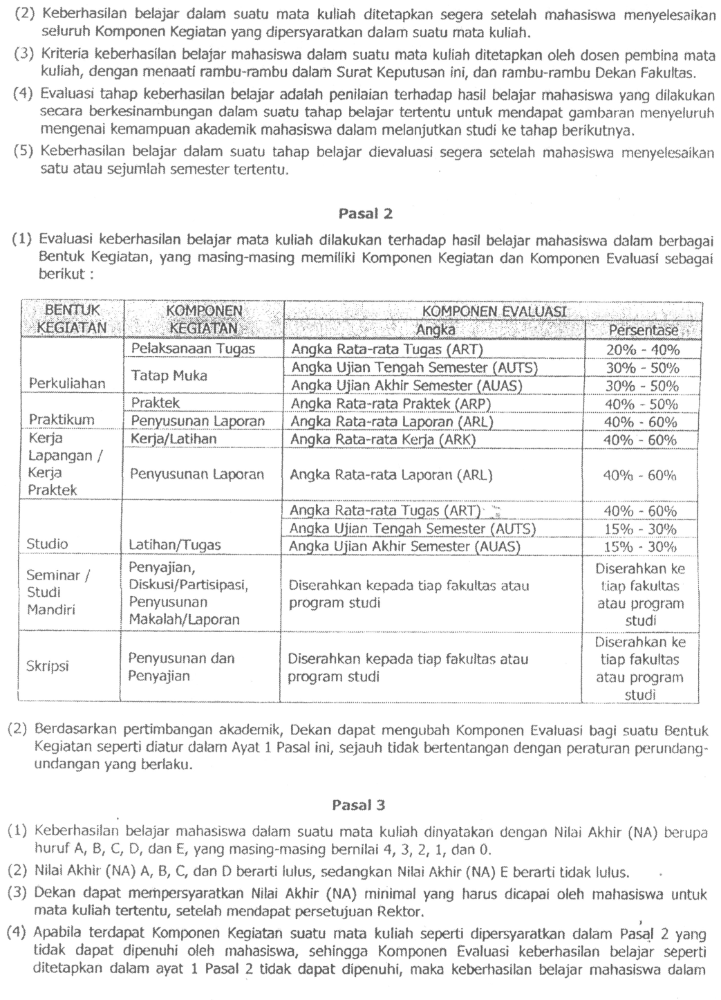
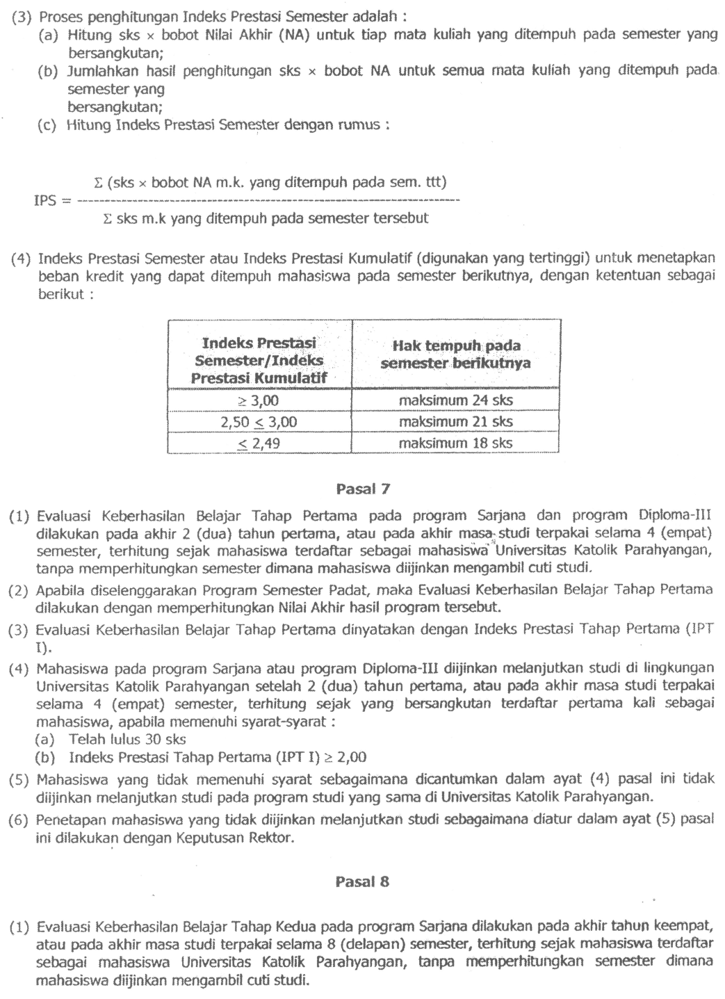
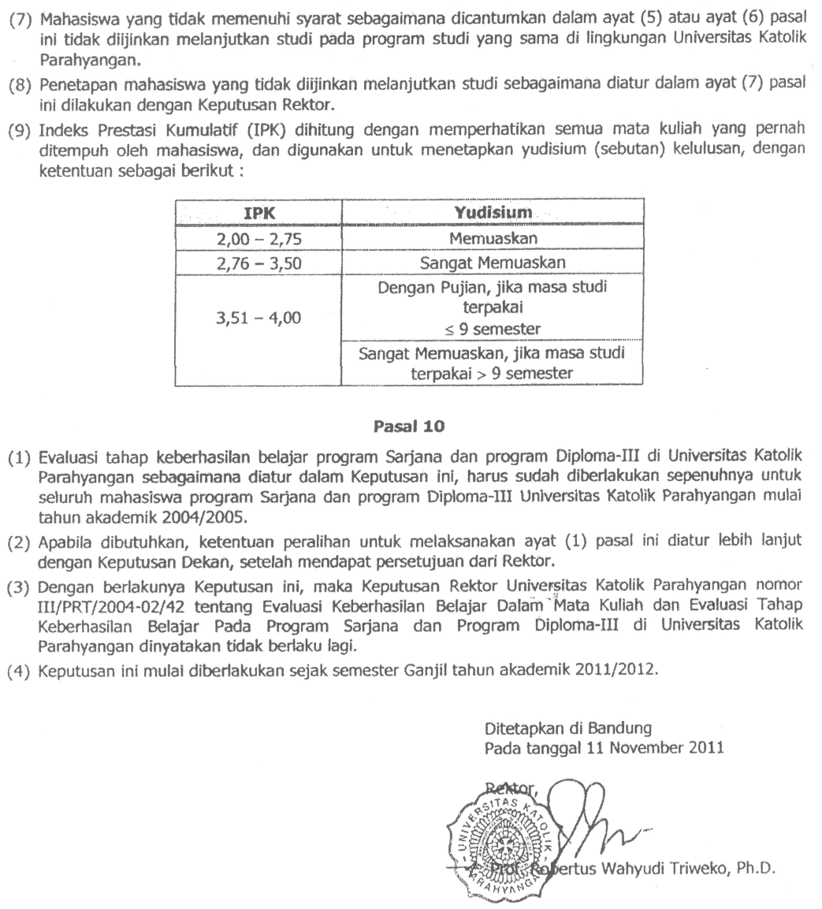
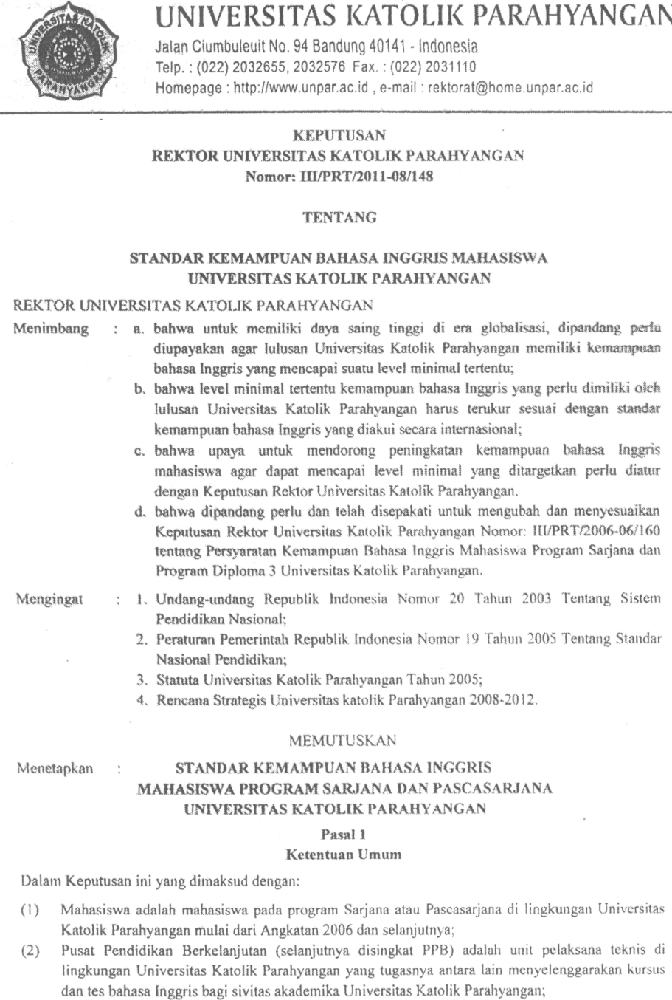
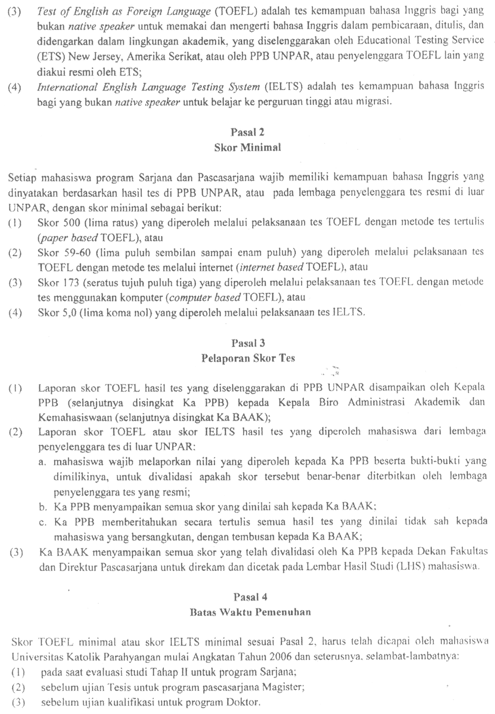

> **Catatan**: Perubahan-perubahan yang terjadi di FTIS (pimpinan, peraturan) terjadi cukup cepat, sedangkan juklak hanya diperbaharui paling cepat setahun sekali. Dokumen ini adalah versi _unofficial_ dari Juklak, dengan perubahan-perubahan terkini. -Pascal-

**PETUNJUK PELAKSANAAN KEGIATAN AKADEMIK TAHUN 2014/2015**

**FAKULTAS TEKNOLOGI INFORMASI DAN SAINS (FTIS) UNIVERSITAS KATOLIK PARAHYANGAN**  
**Jl. Ciumbuleuit 94 Bandung 40141**  

Tlp. +62-22-204-1964 Ext. 707  
Faks. +62-22-204-2141  
ftis@unpar.ac.id  
[http://www.unpar.ac.id](http://www.unpar.ac.id)  

**Tim Penyusun**  

* Cecilia Esti Nugraheni
* Livia Owen
* Farica Edgina Yosafat
* Luciana Abednego
* Pranyoto Teguh Imanto
* Thomas Anung Basuki  

Copyright &copy; 2014 FTIS UNPAR

# KATA PENGANTAR DEKAN FAKULTAS TEKNOLOGI INFORMASI DAN SAINS UNPAR

Sejak berdirinya Fakultas Teknologi Informasi dan Sains (d/h Fakultas Matematika dan Ilmu Pengetahuan Alam) - Universitas Katolik Parahyangan pada tahun 1993, Fakultas berupaya untuk meningkatkan kualitas pelaksanaan Tridharma Perguruan Tinggi (Pengajaran – Penelitian – Pengabdian Kepada Masyarakat) secara bertahap dan berkesinambungan sesuai dengan visi dan misi yang diembannya. Pada tahun 2007, Universitas Katolik Parahyangan berkomitmen untuk melaksanakan penjaminan mutu internal sesuai dengan ketentuan Peraturan Pemerintah Republik Indonesia Nomor 19 Tahun 2005 tentang Standar Nasional Pendidikan. Untuk menjamin bahwa standar-standar yang telah ditetapkan dalam Sistem Penjaminan Mutu Internal Universitas Katolik Parahyangan dapat terlaksana dengan baik, Fakultas menerbitkan Buku Petunjuk Pelaksanaan Kegiatan Akademik Fakultas Teknologi Informasi dan Sains Tahun Akademik 2013 – 2014 sebagai pedoman bagi seluruh civitas academica Fakultas dalam melaksanakan kegiatan akademik.

Berdasarkan pengalaman dalam pengelolaan Fakultas, didapati sejumlah kasus kegagalan dalam pelaksanaan kegiatan akademik dan administrasi yang disebabkan karena ketidaktahuan civitas academica pada sejumlah ketentuan akademik dan administratif yang berlaku. Oleh karena itu, setiap anggota civitas academica Fakultas diharapkan mempelajari dan memahami dengan seksama setiap ketentuan yang tertuang dalam buku petunjuk pelaksanaan kegiatan akademik tersebut. Penerbitan buku petunjuk versi terbaru akan dilakukan secara rutin pada setiap awal tahun akademik, sehingga civitas academica di lingkungan Fakultas memperoleh informasi terkini tentang tatacara pelaksanaan kegiatan akademik yang berlaku di lingkungan Fakultas. Dengan demikian, diharapkan civitas academica Fakultas selalu mengacu pada informasi-informasi yang tercantum dalam buku petunjuk terkini dalam melaksanakan kegiatan akademik. Apabila dalam pelaksanaan kegiatan akademik ditemukan hal-hal yang kurang jelas dalam buku petunjuk tersebut, maka civitas academica dapat menghubungi para pimpinan di lingkungan Fakultas untuk memperoleh penjelasan. Beberapa hal yang belum tercantum dalam buku petunjuk ini akan disampaikan melalui papan pengumuman serta media komunikasi lainnya, dan 
akan diakomodasi dalam buku petunjuk pelaksanaan kegiatan akademik tahun akademik berikutnya.

Semoga buku petunjuk ini dapat membantu kelancaran pelaksanaan kegiatan akademik, yang selanjutnya akan berdampak pada peningkatan kualitas pembelajaran yang berkesinambungan. Setiap kritik dan saran berkaitan dengan penyempurnaan buku ini sangat kami harapkan dan hargai.
Selamat berkarya, semoga Tuhan memberkati kita atas karya-karya yang kita hasilkan.

**Bandung**,  
**Dekan**, 
  
**Paulus Cahyono Tjiang, Ph.D.**

# BAB 1 PENDAHULUAN  
## 1.1 Sejarah Fakultas Teknologi dan Sains  

Fakultas Teknologi Informasi dan Sains (FTIS) Universitas Katolik Parahyangan (UNPAR) berawal dari Fakultas Matematika dan Ilmu Pengetahuan Alam (FMIPA). Pendirian FMIPA telah dikukuhkan dengan terbitnya Surat Keputusan Menteri Pendidikan dan Kebudayaan Republik Indonesia nomor 34/D/O/1993 tanggal 20 April 1993, yang langsung menetapkan status akreditasi &ldquo;terdaftar&rdquo; bagi dua Program Studi FMIPA, yaitu Program Studi Matematika dan Fisika. Dengan terbitnya Keputusan Direktur Jenderal Pendidikan Tinggi Departemen Pendidikan dan Kebudayaan Republik Indonesia nomor: 420/DIKTI/Kep/1996 tanggal 8 Agustus 1996, ditetapkan status &ldquo;terdaftar&rdquo; pula untuk Program Studi Ilmu Komputer.

Perubahan nama FMIPA menjadi Fakultas Teknologi Informasi dan Sains (FTIS) terjadi karena adanya perubahan nama Program Studi Ilmu Komputer. Berdasarkan surat Direktur Jenderal Pendidikan Tinggi Departemen Pendidikan Nasional Nomor 4382/D/T/2008 tertanggal 10 Desember 2008 perihal Ralat Perpanjangan Ijin Penyelenggaraan Program Studi pada Universitas Katolik Parahyangan, dari tertulis : Jurusan/Program Studi Ilmu Komputer diharuskan untuk berubah menjadi Jurusan/Program Studi Teknik Informatika. Adanya perubahan nama ini membuat nama FMIPA sebagai naungan bagi Program Studi Teknik Informatika menjadi tidak selaras lagi. Perubahan nama FMIPA menjadi FTIS ini berdasarkan Keputusan Pengurus Yayasan Universitas Katolik Parahyangan Nomor : II/2009-04/05-SK tanggal 1 April 2009.
    
Ketiga program studi tersebut saat ini telah memperoleh status akreditasi dari Badan Akreditasi Nasional Perguruan Tinggi (BAN-PT) dengan rincian sebagai berikut :

* Program Studi Matematika memperoleh status akreditasi dengan peringkat A (Amat baik) berdasarkan Keputusan BAN-PT Nomor 029/BAN-PT/AK-XIII/S1/XI/2010 tertanggal 3 Desember 2010 dengan masa berlaku hingga 3 Desember 2015. 
* Program Studi Fisika memperoleh status akreditasi dengan peringkat B (Baik) berdasarkan Keputusan BAN-PT Nomor 036/BAN-PT/AK-XIII/S1/I/2011 tertanggal 7 Januari 2011 dengan masa berlaku hingga 7 Januari 2016.
* Program Studi Teknik Informatika memperoleh status akreditasi dengan peringkat B (Baik) berdasarkan Keputusan BAN-PT Nomor 042/BAN-PT/AK-XIII/S1/I/2011 tertanggal 21 Januari 2011 dengan masa berlaku hingga 21 Januari 2016
    
Ketiga program studi yang sekarang berada dalam naungan FTIS ini dilaksanakan berdasarkan suatu kurikulum yang berbobot 144 sks (satuan kredit semester) dengan rincian selanjutnya akan diuraikan pada bagian berikutnya.

## 1.2 Visi, Misi, Tujuan, dan Sasaran FTIS  

Visi dan Misi FTIS - UNPAR mengacu pada visi dan misi UNPAR. Visi UNPAR adalah

> Menjadi komunitas akademik humanum yang bersemangat kasih dalam kebenaran untuk  mengembangkan potensi lokal pada
> tataran internasional demi peningkatan  martabat manusia dan keutuhan alam ciptaan.  

Sebagai sebuah lembaga ilmiah, misi UNPAR adalah melaksanakan  

 * pengembangan dan pewarisan nilai budaya secar kritis – kreatif;
 * proses pembelajaran yang berpusat pada mahasiswa;
 * penelitian dan penyebarluasan hasilnya melalui proses pembelajaran dan pengabdian kepada masyarakat; dan
 * pengabdian kepada masyarakat,
 
sesuai dengan sesanti *Bakuning Hyang Mrih Guna Santyaya Bhakti*, yang berarti Berdasarkan Ketuhanan Menuntut Ilmu untuk Dibaktikan kepada Masyarakat. Melalui visi dan misi UNPAR, dirumuskanlah visi dan misi beserta tujuan FTIS UNPAR.

### 1.2.1 Visi FTIS  

Visi FTIS 2020 adalah sebagai berikut:  

> Menjadikan FTIS UNPAR sebagai suatu komunitas akademik beriman yang dapat mengembangkan bidang-bidang teknologi informasi   dan sains dengan mengangkat potensi lokal pada tataran internasional untuk peningkatan martabat manusia.
        
FTIS UNPAR bertekad untuk menjadi komunitas akademik beriman, yaitu masyarakat yang secara cerdas dan kritis senantiasa mencari, menjunjung tinggi, dan menyebarluaskan kebenaran. Hal ini merupakan perwujudan dari keyakinan kepada Tuhan Yang Maha Esa, sesuai dengan sesanti UNPAR *Bakuning Hyang Mrih Guna Santyaya Bhakti*.

Menjelang tahun 2020, FTIS UNPAR akan lebih memberikan perhatian kepada potensi lokal, yaitu kekuatan, keunggulan, keunikan  asli (*indigenous*) yang terkandung di bumi Indonesia, khususnya di wilayah Jawa Barat. Ini berarti bahwa proses pendidikan, penelitian, dan pengabdian kepada masyarakat harus memberi perhatian pada masalah-masalah yang secara nyata dihadapi oleh    masyarakat dan bangsa Indonesia, khususnya di wilayah Jawa Barat. Dengan mengacu kepada bidang-bidang keilmuan di dalam FTIS, potensi lokal tersebut harus dikembangkan secara kreatif dan kritis, sehingga mampu untuk disejajarkan dan dikompetisikan pada tataran internasional.

Sebagai Universitas Katolik, UNPAR menaruh perhatian utama pada peningkatan martabat manusia. Kegiatan pendidikan yang ditujukan untuk menyiapkan generasi muda sebagai calon pemimpin masa depan dimaskudkan agara mereka berkembang menjadi manusia yang utuh yang memiliki keseimbangan antara rasio, rasa, raga, dan rukun. Untuk itu, proses pendidikan yang berlangsung di UNPAR dan di dalam FTIS harus mampu memberikan pengalaman belajar kepada para mahasiswa, bukan hanya dalam pengembangan rasio yang dilaksanakan berdasarkan kurikulum, melainkan juga pengembangan rasa, raga, dan rukun melalui interaksi dan pergaulan hidup sehari-hari di lingkungan kampus UNPAR. Untuk mencapai keunggulan di dalam hal di atas, FTIS UNPAR harus senantiasa mengembangkan potensi lokal ke tataran internasional. Oleh karena itu, pembangunan suasana akademik yang kondusif merupakan bagian yang sangat penting dalam pembentukan manusia yang bermartabat dan pengembangan potensi lokal tersebut.
 
### 1.2.2 Misi FTIS

Misi Fakultas Teknologi Informasi dan Sains (FTIS) adalah:  

1. Menyelenggarakan program akademik jenjang sarjana dengan memperhatikan visi FTIS untuk menghasilkan lulusan yang:
    - Mampu mengembangkan bidang-bidang teknologi informasi dan sains serta aplikasinya.
    - Mampu memecahkan permasalahan di bidang teknologi informasi dan sains melalui kegiatan penelitian berdasarkan kaidah-kaidah ilmiah serta menerapkannya untuk peningkatan martabat manusia.
2. Menghasilkan penelitian di bidang teknologi informasi dan sains yang dapat meningkatkan martabat manusia secara langsung ataupun tidak langsung, serta memanfaatkan hasil penelitian untuk pengembangan proses pembelajaran dan pengabdian kepada masyarakat.
3. Menjalin kerja sama dengan berbagai pihak baik internal ataupun eksternal untuk meningkatkan keterkaitan proses pembelajaran, penelitian dan pengabdian kepada masyarakat.
 

### 1.2.3 Tujuan FTIS

Tujuan FTIS adalah menghasilkan lulusan yang memiliki kompetensi sebagai berikut:  

- Berbudi pekerti luhur, disiplin, jujur, cinta pada sesama dan lingkungan serta berjiwa religius dalam rangka mengamalkan Pancasila dan Undang-Undang Dasar 1945.
- Memiliki pengetahuan dasar Matematika, Fisika, atau Teknik Informatika, yang kokoh dan berkemampuan bernalar yang baik, logis, matematis, dan/atau fisis; 
- Memiliki kemampuan memodelkan dan menyelesaikan permasalahan matematika, fisika, atau permasalahan di berbagai bidang (interdisiplin), dan khusus untuk sarjana Teknik Informatika mampu membangun perangkat lunak dan menyesuaikan diri terhadap perkembangan teknologi informasi; 
- Memiliki wawasan yang luas tentang perkembangan Ilmu Matematika, Fisika, atau Teknik Informatika, dan penerapannya dan mampu bersaing di tataran nasional maupun internasional.

Selain itu FTIS juga memberikan perhatian khusus bagi pengembangan dosen dan tenaga kependidikan agar mampu memberikan pelayanan prima di bidang akademik dan non akademik serta mengembangkan sarana dan prasarana yang memadai yang memenuhi standar nasional maupun internasional.

### 1.2.4 Sasaran FTIS

Sasaran FTIS adalah sebagai berikut:  

- Tercapainya sistem pengelolaan  yang profesional dan berkualitas.
- Mencapai efektivitas dan efisiensi pemanfaatan sarana, prasarana dan dana untuk menjamin keberlanjutan dan keunggulan.
- Menghasilkan lulusan yang unggul dan berdaya saing yang tinggi.
- Tercapainya kerja sama berkelanjutan dengan berbagai lembaga akademik dan non akademik.

## 1.3 Keberhasilan FTIS

Dalam kurun waktu 21 tahun sejak didirikan, FTIS telah menghasilkan 1.097 lulusan sampai dengan 26 Februari 2014. Sebagian dari lulusan tersebut, terutama dari prodi Teknik Informatika, membawa pula sertifikasi internasional di bidang sistem teknologi jaringan melalui program kerjasama Cisco-UNPAR. Sebagian dari mereka melanjutkan studi di perguruan tinggi dalam dan luar negeri dan beberapa berhasil mendapatkan beasiswa penuh selama studi melalui AUSAID, University of Twente, Ditjen Dikti, DEPKOMINFO, BPPS dan Asosiasi Perguruan Tinggi Katolik (APTIK). Sebagian dari mereka berkarya di bidang perbankan, industri, BUMN, dan lain-lain.

Saat ini FTIS dikelola oleh 41 dosen, 13 di antaranya telah bergelar Doktor atau PhD dan 26 dosen telah berijasah S-2. Saat ini 3 orang dosen sedang studi S-3 di luar negeri, 4 orang dosen sedang studi S-3 di dalam negeri, 1 orang dosen studi S-2 di dalam negeri dan 1 orang studi S-2 di luar negeri.

Sejak tahun 2000, FTIS secara rutin mengirim tim untuk mengikuti kompetisi pemrograman tingkat internasional yang diselenggarakan oleh organisasi ACM (*Association of Computing Machinery*), kompetisi jaringan komputer CISCO NetRiders, mengikuti kompetisi matematika tingkat universitas, lomba karya tulis ilmiah dan sebagainya. 

## 1.4 Pengelolah Fakultas  

1. Senat FTIS
    - Ketua : Agus Sukmana, SSi, MSc
    - Sekretaris : Philips Nicolas Gunawidjaja, BSc, PhD
2. Dekanat
    - Dekan : Dr. Ferry Jaya Permana, ASAI
    - WD 1 (Akademik) : Dr. Thomas Anung Basuki
    - WD II (Keuangan dan Sumberdaya) : Maria Anestasia, SSi, MSi
    - WD III (Kemahasiswaan dan Alumni) : Dr.rer.nat. Cecilia E.Nugraheni, ST, MT
3. Program Studi Matematika
    - Ketua : Dr. Ferry Jaya Permana
    - Sekretaris : Livia Owen, SSi, MSi
4. Program Studi Fisika
    - Ketua : Philips Nicolas Gunawidjaja, BSc, PhD
    - KaLab. Fisika Dasar : Risti Suryantari, S.Si., M.Si.
    - KaLab. Elektronika &amp; Fisika Lanjut : Janto V. Sulungbudi, Drs.
5. Program Studi Teknik Informatika
    - Ketua : Mariskha Tri Adithia, SSi, MSc
    - Sekretaris : Husnul Hakim, S.Kom, MT
    - KaLab. Komputasi : Chandra Wijaya, ST, MT
6. Tata Usaha
    - Kepala : Pranyoto Teguh Imanto
    - Kasubag Akademik : Petrus Purnomo
    - Kasubag Keuangan &amp; Kepegawaian : Budi Santoso
    - Kasubag Kemahasiswaan &amp; Alumni : Fransiscus Sudarno
    - Kasubag Umum &amp; Perlengkapan : Walip, A.Md
    - Staf Akademik : Rikie Setiawan, S.AB.
    - Staf Keuangan &amp; Kepegawaian : Filifo Zebua, Dwina Irlistriarti, Dra.

## 1.5 Daftar Dosen FTIS  

Berikut adalah daftar nama dosen FTIS beserta, latar belakang pendidikan, mata kuliah yang diampu pada Semester Ganjil 2013/2014, alamat email dan *website*.  

1. Guru Besar
    * Prof B. Suprapto Brotosiswojo, Dr. (Purdue University,USA):  
    Fisika, Komputasi, Komputasi Kuantum, Pemodelan Matematika Gejala Alam.  
    Email: bensupra@unpar.ac.id
2. Lektor Kepala
    * Agus Sukmana, Drs. (ITB), MSc (Twente Univ. - Belanda), studi S-3 (UPI):  
    Teori Peluang, Pengendalian Mutu, Statistika Elementer.  
    Email: asukmana@unpar.ac.id
    * Aloysius Rusli, Dr. (Leeds University, UK):  
    Fisika Polimer, Pengenalan Program Studi Fisika, Etika Profesi, Reologi.  
    Email: arusli@unpar.ac.id
    * Benny Yong, SSi. (UNPAR), MSi. (ITB):  
    Pemecahan Masalah Matematika, Teori Bilangan, Pemodelan Matematika.  
    Email: benny_y@unpar.ac.id
    * Ferry Jaya Permana, SSi (ITB), MSi (ITB), PhD (TU Delft - Belanda):  
    Teori Risiko, Teori Suku Bunga, Kalkulus Keuangan.  
    Email: ferryjp@unpar.ac.id
    * Iwan Sugiarto, SSi (UNPAR), MSi (ITB):  
    Metoda Matematika, Fungsi Kompleks, Optimasi.  
    Email: iwans@unpar.ac.id
    * Julius Dharma Lesmono, SSi (ITB), SE (UNPAR), MT (ITB), MSc (Twente University - Belanda), Dr. (University of Queenslands - Australia):  
    Proses Stokastik, Statistika Matematika, Kontrol Optimum.  
    Email: jdharma@unpar.ac.id
    * Nico Saputro, ST (ITB), MT (ITB), Studi S-3 (Univ. of Illinois - USA).  
    Email: nico@unpar.ac.id
    * Paulus Cahyono Tjiang, Drs. (ITB), PhD (Australian National University):  
    Listrik Magnet, Elektrodinamika, Mekanika Kuantum Relativistik, Teori Medan Kuantum.  
    Email: pctjiang@unpar.ac.id
    * Sylvia Hastuti Sutanto, SSi (ITB), PhD (Australian National University):  
    Fisika Matematika 3 &amp; 4, Mekanika Hamiltonian, Dinamika Fluida.  
    Email: sylvia@unpar.ac.id
    * Marcus Wono Setya Budhi, PhD (Univ. of Illinois - USA):  
    Persamaan Differensial Parsial, Analisis Real, Struktur Aljabar.  
    Email: wono@math.itb.ac.id
    * Veronica Sri Moertini, ST (ITB), MT (ITB), Dr. (ITB):  
    Basis Data, Penambangan Data, Projek Sistem Informasi.  
    Email: moertini@unpar.ac.id
3. Lektor
    * Cecilia Esti Nugraheni, ST (ITB), MT (ITB), Dr. rer. Nat. (Institut fuer Informatik, Ludwig - Maximilians Universitaet - Germany):  
    Matematika Diskret, Jaringan Syaraf Tiruan.  
    Email: cheni@unpar.ac.id
    * Erwinna Chendra, SSi(UNPAR), MSi(ITB), Studi S-3 Matematika di ITB  
    Email: erwinna@unpar.ac.id  
    Website: http://www.unpar.ac.id/erwinna
    * Liem Chin, SSi.(UNPAR), MSi.(ITB):  
    Matematika Diskret, Aljabar Linear, Komputasi Statistika.  
    Email: chin@unpar.ac.id
    * Oerip S. Santoso, dr (UI), MSc. (Univ. Wisconsin Madison.USA), Dr.(Univ. Paris VI):  
    Struktur Diskret, Grafika Komputer, Komputer dan Masyarakat, Projek Perangkat Lunak.  
    Email: oerip_ss@yahoo.com
    * Philips Nicolas Gunawidjaja, BSc. (University of Warwick,UK), PhD. (University of Warwick, UK):  
    Keterampilan Fisika, Elektronika 1 &amp; 2, Struktur Materi.  
    Email: philips@unpar.ac.id
    * Rosa de Lima E.P., SSi (ITB), MT (ITB), Studi S-3 di UPI:  
    Sistem Informarsi, Sistem Pendukung Keputusan.  
    Email: rosad5@unpar.ac.id
    * Farah Kristiani, SSi (UNPAR), MSi (ITB), Studi S-3 Matematika di Universiti Pendidikan Sultan Idris, Malaysia.  
    Email: farah@unpar.ac.id
4. Asisten Ahli
    * Elisati Hulu, ST (ITB), MT (ITB), Studi S-3 di ITB.  
    Email: elisatih@unpar.ac.id
    * Gede Karya, ST (ITB), MT (ITB):  
    Pemrograman Aplikasi Bergerak, Analisis Proses Bisnis.  
    Email: gkarya@unpar.ac.id
    * Ivonne Martin, SSi (UNPAR), MSc. (TU Delft - Belanda): Studi S-3 Matematika di Leiden University, Belanda.  
    Email: ivonne@unpar.ac.id
    * Janto Vincent Sulungbudi, SSi (ITB):  
    Laboratorium Fisika Instrumentasi, Instrumentasi Berbasis Komputer, Pengantar Kontrol Otomatis.  
    Email: janto@unpar.ac.id, janto.sulungbudi@gmail.com
    * Lionov, S.Kom (UNPAR), MSc. (Utrecht Univ. - Belanda):  
    Pemrograman Berorientasi Objek, Algoritma dan Struktur Data, Koordinator Skripsi.  
    Email: lionov@unpar.ac.id
    * Livia Owen, SSi (UNPAR), MSi (ITB):  
    Kalkulus Vektor, Komputasi Matematika, Fisika Matematik II.  
    Email: livia.owen@unpar.ac.id
    * Luciana Abednego, S.Kom (UNPAR), MT (ITB):  
    Logika Informatika, Algoritma dan Struktur Data, Grafika Komputer.  
    Email: luciana@unpar.ac.id
    * Taufik Limansyah, SSi (UNPAR), Studi S-2 Teknik Industri di UNPAR:  
    Kalkulus 1, Kalkulus II, Fisika Matematik 1.  
    Email: taufik.limansyah@unpar.ac.id
    * Thomas Anung Basuki, ST (ITB), MKom (UI), Dr. (University of Pisa - Italia):  
    Pengantar Sistem Cerdas, Rekayasa Perangkat Lunak, Penulisan Ilmiah.  
    Email: anung@unpar.ac.id
    * Maria Anestasia, SSi (ITB), MSi (ITB):  
    Kalkulus 2, Persamaan Diferensial Biasa, Kalkulus Vektor.  
    Email: maria.anestasia@unpar.ac.id
5. Golongan III
    * Chandra Wijaya, S.Kom (UNPAR), MT (ITB):  
    Jaringan Komputer, Sistem Digital.  
    Email: chandraw@unpar.ac.id
    * Elok Fidiani, SSi (UGM), MSc (TU Dresden):  
    Fisika Dasar, Fisika Statistik, Pengantar Fisika Material, Nanoteknologi dan Lingkungan.  
    Email: elokfidiani@unpar.ac.id, elokfidiani@gmail.com
    * Flaviana Catherine, SSi (UNPAR), MSi (ITB):  
    Fisika Dasar, Pengantar Fisika Nuklir, Fisika Kedokteran, Fisika Instrumentasi Medis.  
    Email: flaviana@unpar.ac.id
    * Haryanto Mangaratua Siahaan, SSi (ITB), MSi (ITB), Studi S-3 di University of Saskatchewan.  
    Email: haryanto.siahaan@gmail.com
    * Kian Ming, SSi (UNPAR), S-2 (ITB):  
    Fisika Dasar, Teori Relativitas, Kosmologi Relativistik  
    Email: kian.ming@unpar.ac.id.
    * Mariskha Tri Adithia, SSi (ITB), MSc (Universiteit Eindhoven - Belanda), PDEng (Universiteit Eindhoven - Belanda):  
    Struktur Diskret, Kriptografi, Logika Informatika.  
    Email: mariskha@unpar.ac.id
    * Pascal Alfadian, S.Kom (UNPAR), MCom (NUS - Singapore):  
    Analisis dan Desain Berorientasi Objek, Pemrograman Beorientasi Objek.  
    Email: pascal@unpar.ac.id
    * Risti Suryantari, SSi (UGM), MSc (UGM):  
    Fisika Dasar, Fisika Modern, Gelombang, Fisika Kristal Cair.  
    Email: ristisuryantari@unpar.ac.id.
    * Husnul Hakim, S.Kom (ITS), MT (ITB):  
    Pemrograman Berorientasi Obyek, Algoritma dan Struktur Data.  
    Email: husnulhakim@unpar.ac.id
    * Vania Natali, S.Kom (UNPAR), studi S2 - ITB.  
    Email: vania.natali@unpar.ac.id

# BAB 2 PENYELENGGARAAN MATA KULIAH

Secara umum mata kuliah yang diselenggarakan oleh program studi dapat dikelompokkan ke dalam dua jenis yaitu **mata kuliah wajib** dan **mata kuliah pilihan**. Mata kuliah wajib merupakan mata kuliah yang sifatnya wajib/harus ditempuh oleh setiap mahasiswa. Sebagian dari mata kuliah wajib tersebut termasuk ke dalam kelompok **mata kuliah umum** (MKU), yaitu mata kuliah yang terkait dengan pengembangan kepribadian yang diselenggarakan oleh Lembaga Pengembangan Humaniora. 
	
Mata kuliah pilihan bertujuan untuk menyiapkan mahasiswa untuk memasuki dunia kerja dan memperluas wawasan mahasiswa terhadap bidang ilmu lain sehingga memungkinkan melakukan tugas interdisiplin. Mata kuliah pilihan dapat diambil dari mata kuliah pilihan yang diselenggarakan oleh program studi (prodi) yang bersangkutan, atau mata kuliah (baik wajib maupun pilihan) yang diselenggarakan oleh prodi lain di lingkungan UNPAR. Mahasiswa mengambil mata kuliah pilihan berdasarkan persetujuan dari dosen wali.
	
Selain mata kuliah-mata kuliah di atas, dikenal juga apa yang disebut dengan **mata kuliah prasyarat**. Mata kuliah prasyarat adalah mata kuliah yang harus ditempuh seorang mahasiswa sebelum ia dapat menempuh suatu mata kuliah tertentu.
	
Di samping mata kuliah-mata kuliah yang ditujukan untuk program studinya sendiri, prodi-prodi juga menyelenggarakan mata kuliah yang ditujukan untuk program studi lain. Mata kuliah ini disebut dengan **mata kuliah layanan**.
	
Selain tatap muka di kelas, suatu mata kuliah dapat mengandung kegiatan lain untuk mendukung perkuliahan, yaitu asistensi, responsi, atau praktikum yang biasa disingkat dengan **APR**.

## 2.1 Mata Kuliah Pilihan

Mahasiswa harus menempuh sejumlah SKS tertentu mata kuliah pilihan, dengan sejumlah SKS di antaranya 
mata kuliah yang diselenggarakan prodinya. Jumlah SKS mata kuliah ini berbeda-beda untuk setiap prodi: 

1. Untuk Matematika, 48 SKS dengan minimal lulus 15 SKS berasal dari salah satu bidang kajian (Rekayasa Keuangan atau Matematika Industri).
2. Untuk Fisika, 24 SKS yang dapat diambil dari seluruh prodi di UNPAR.
3. Untuk Teknik Informatika, 30 SKS dengan banyaknya mata kuliah pilihan dari luar jurusan yang dapat diperhitungkan dalam kelulusan adalah sebanyak-banyaknya 4 (empat) mata kuliah.

Untuk mata kuliah pilihan, terdapat beberapa ketentuan sebagai berikut:

1. Bila mata kuliah tersebut memiliki prasyarat, mahasiswa dari prodi lain tidak perlu memenuhi prasyarat tersebut.
2. Mata kuliah pilihan dan mata kuliah di prodi lain yang ekuivalen dengannya, hanya dapat diperhitungkan salah       satunya.

## 2.2 Mata Kuliah Prasyarat

Mata kuliah prasyarat adalah mata kuliah yang harus ditempuh seorang mahasiswa sebelum ia dapat menempuh suatu mata kuliah tertentu. Berkaitan dengan hal ini, terdapat tiga kategori:  

1. Prasyarat tempuh, artinya mata kuliah tersebut telah terdaftar dalam rencana studi mahasiswa yang bersangkutan dan bernilai akhir A, B, C, D,atau E, walaupun tentunya kelulusan akan sangat menunjang penempuhan mata kuliah berikutnya.
2. Prasyarat lulus, artinya mahasiswa harus lulus mata kuliah prasyarat tersebut terlebih dahulu. Pada umumnya syarat kelulusan adalah nilai akhir minimum D, meskipun ada juga yang lebih tinggi. Silahkan melihat silabus mata kuliah ybs. untuk keterangan lebih lanjut.
3. Mahasiswa di luar prodi penyelenggara mata kuliah tidak wajib memenuhi prasyarat ini.

## 2.3 Mata Kuliah Layanan

Mata kuliah layanan adalah mata kuliah yang dibina oleh prodi yang ada di FTIS untuk memenuhi kebutuhan mata kuliah pada prodi lain di lingkungan UNPAR. 

### 2.3.1 Kuliah Layanan Program Studi Matematika

| KODE   | MATA KULIAH                 | SKS |  PRODI YANG DILAYANI |
|--------|-----------------------------|-----|----------------------|
| AMS100 | Matematika Informatika      | 4   | Teknik Informatika   |
| AMS200 | Probabilitas dan Statistika | 3   | Teknik Informatika   |
| AMS107 | Fisika Matematika 1         | 4   | Fisika               |
| AMS108 | Fisika Matematika 2         | 4   | Fisika               |
| AMS103 | Kalkulus I                  | 2   | Teknik Industri      |
| AMS104 | Kalkulus II                 | 2   | Teknik Industri      |
| AMS203 | Matriks dan Ruang Vektor    | 3   | Teknik Industri      |
| AMS204 | Kalkulus Peubah Banyak      | 2   | Teknik Industri      |
| AMS105 | Kalkulus I                  | 3   | Teknik Kimia         |
| AMS106 | Kalkulus II                 | 3   | Teknik Kimia         |
| AMS101 | Matematika 1                | 3   | Teknik Sipil         |
| AMS102 | Matematika 2                | 3   | Teknik Sipil         |
| AMS201 | Matematika 3                | 3   | Teknik Sipil         |
| AMS202 | Matematika 4                | 3   | Teknik Sipil         |
| ESE 103| Matematika Untuk Ekonomi    | 6   | Ekonomi              |
| ESE 104| Statistika Untuk Ekonomi    | 6   | Ekonomi              |
| ESM 102| Matematika Bisnis           | 3   | Manajemen            |
| ESM 103| Statistika Bisnis           | 3   | Manajemen            |
| ESA 103| Statistika                  | 2   | Akuntansi            |
| ESA 205| Matematika Keuangan         | 2   | Akuntansi            |

### 2.3.2 Kuliah Layanan Program Studi Fisika

| KODE    | MATA KULIAH            | SKS | PRODI YANG DILAYANI |
|---------|------------------------|-----|---------------------|
| APS 181 | Fisika Dasar           | 4   | Matematika          |
| APS 182 | Fisika Dasar           | 3   | Teknik Sipil        |
| APS 183 | Fisika Dasar 1         | 2   | Teknik Industri     |
| APS 184 | Fisika Dasar 2         | 2   | Teknik Industri     |
| APS 185 | Fisika Dasar 1         | 2   | Teknik Kimia        |
| APS 186 | Fisika Dasar 2         | 2   | Teknik Kimia        |
| APS 178 | Praktikum Fisika Dasar | 1   | Teknik Sipil        |
| APS 189 | Praktikum Fisika Dasar | 1   | Teknik Industri     |
| APS 191 | Fisika Dasar 1         | 3   | Teknik Elektro      |
| APS 192 | Fisika Dasar 2         | 3   | Teknik Elektro      |
| APS 193 | Praktikum Fisika Dasar | 1   | Teknik Elektro      |
| FFT 113 | Kosmologi              | 2   | Filsafat            |

### 2.3.3 Kuliah Layanan Program Studi Teknik Informatika

| KODE   | MATA KULIAH          | SKS | PRODI YANG DILAYANI |
|--------|----------------------|-----|---------------------|
| AKS144 | Pemrograman Komputer | 3   | Matematika          |

## 2.4 Mata Kuliah Umum

Mata Kuliah Umum (MKU) adalah mata kuliah kepribadian yang diselenggarakan oleh Lembaga Pengembangan Humaniora (LPH). Silabus, jadwal kuliah, materi, dan penyediaan serta penugasan dosen seluruhnya diatur oleh LPH. Semester penyelenggaraan setiap MKU disesuaikan dengan kurikulum masing-masing prodi. 

### 2.4.1 Susunan Mata Kuliah Umum

| KODE   | MATA KULIAH                | SKS |
|--------|----------------------------|-----|
| MKU001 | Pendidikan Pancasila       | 2   |
| MKU002 | Pendidikan Kewarganegaraan | 2   |
| MKU003 | Agama Katolik              | 2   |
| MKU004 | Fenomenologi Agama         | 2   |
| MKU008 | Etika                      | 2   |
| MKU009 | Bahasa Indonesia           | 2   |
| MKU010 | Bahasa Inggris             | 2   |
| MKU011 | Estetika                   | 2   |
| MKU012 | Logika                     | 2   |

### 2.4.2 Uraian Singkat Mata Kuliah Umum  

| KODE MK   	|PRASYARAT	|NAMA &amp; DESKRIPSI MATA KULIAH                	|
|---------------|---------------|-----------------------------------------------|
|MKU001 	|	-	|**PENDIDIKAN PANCASILA (*PANCASILA EDUCATION*)** Mata Kuliah Pendidikan Pancasila berupaya menelaah/mengkaji berbagai fenomena kehidupan bangsa dan Negara Indonesia sebagai sebuah ruang publik dengan menggunakan pendekatan hermeneutika (filsafat) dan pendidikan nilai (pedagogik). Dengan bantuan hermenutika mahasiswa diajak berpikir kritis terhadap segala bentuk ideologisme Pancasila dan melalui pendidikan nilai mahasiswa dilatih untuk memiliki nilai Pancasila. Nilai pengembangan diri intra-personal dan relasi inter-personal dapat tertanam melalui pendidikan Pancasila yang tujuannya adalah membangun kepribadian (*character building*) manusia Indonesia yang utuh, baik menyangkut aspek kognitif, afektif, maupun psikomotor. Dengan demikian, Pendidikan Pancasila mengajak mahasiswa menilai realitas ruang publik sehari-hari secara mandiri dengan panduan nilai-nilai etis Pancasila.		| 
| MKU002	 |	-	|**PENDIDIKAN KEWARGANEGARAAN (*CIVIC*)** Pendidikan Kewarganegaraan menjelaskan pentingnya pemahaman tentang identitas nasional Indonesia, hak dan kewajiban warga negara Indonesia serta hubungannya dengan hak dan kewajiban asasi manusia. Materi kuliah mencakup juga wawasan nusantara, ketahanan nasional, politik dan strategi nasional, serta implementasinya dalam kehidupan bermasyarakat, berbangsa dan bernegara kesatuan Republik Indonesia.	        | 	
| MKU003	 |	-	|**AGAMA KATOLIK (*CATHOLIC RELIGION*)** Mata kuliah ini membentuk karakteristik mahasiswa sebagai manusia yang memiliki religiusitas melalui pendalaman akan makna agama dan beragama, mendeteksi dinamika Wahyu Tuhan dan iman mereka, memahami relasi dengan Tuhan dan sesama, mengenal makna keselamatan dalam konteks Kerajaan Allah, dan mampu menyatakan ajaran Gereja dalam pelayanan terhadap orang miskin dan terlantar. 		| 	
| MKU004	 |	-	|**FENOMENOLOGI AGAMA (*PHENOMENOLOGY OF RELIGION*)** Fenomenologi Agama merupakan bagian yang tak terpisahkan dari kajian filosofis, kritis, rasional, dan obyektif mengenai substansi ajaran agama. Fenomenologi merupakan sebuah disiplin ilmu yang secara kritis-rasional mengkaji fenomena dan dinamika kehidupan manusia beragama, dari upaya menjadikan Tuhan sebagai tujuan sesembahan sampai menempatkan Tuhan sebagai instrumen legitimasi untuk melakukan tindakan yang justru bertolak belakang dengan kehendak Tuhan yang disembah. Sehubungan dengan itu, kritik konstruktif terhadap perilaku manusia beragama menjadi salah satu poin utama dalam mata kuliah ini. Kesediaan untuk melakukan otoritik terhadap agama sendiri erat terkait dengan upaya menemukan kembali nilai sejati agama atau otentisitas hidup beragama.    | 	
| MKU008 	 |	-	|**ETIKA (*ETHIC*)** Mendalami perilaku sehari-hari yang baik dalam bermasyarakat.|	
| MKU009	 |	-	|**BAHASA INDONESIA (*INDONESIAN*)** Tujuan dari mata kuliah ini adalah untuk mendalami keterampilan berbahasa Indonesia, agar mampu mengkomunikasikan hasil pemikiran serta meningkatkan keterampilan dalam menyusun karya ilmiah. Mata kuliah Bahasa Indonesia ini dimulai dengan mempelajari penulisan kata baku dan non baku serta pengungkapan pikiran dengan pungtuasi yang benar. Selanjutnya dipelajari penyusunan kalimat yang baku serta menghubungkan kalimat-kalimat yang padu dalam menuangkan gagasan dalam sebuah paragraf. Selain itu, dalam mata kuliah ini dipelajari cara menyusun surat dinas yang jelas dan komunikatif. Di akhir kuliah ini, mahasiswa diberi tugas penyusunan makalah dengan benar.      | 	
| MKU010	 |	-	|**BAHASA INGGRIS (*ENGLISH*)** Mata kuliah ini difokuskan pada pemahaman sumber referensi dalam Bahasa Inggris dan pengembangan kosakata Bahasa Inggris (*vocabularies*). Hampir keseluruhan waktu perkuliahan didedikasikan untuk menjelaskan metode mengekstraksi isi bacaan secara tepat dan melatih mahasiswa untuk menerapkan metode tersebut seraya menambah kosakata-kosakata baru. Mahasiswa juga dilatih untuk mempresentasikan hasil pemahamannya akan isi bahan bacaan. |
|MKU011		 |	-	|**ESTETIKA (*ESTHETICS*)** Mata kuliah estetika memberi pemahaman konseptual filosofis &ldquo;seni&rdquo; dalam khasanah keilmuan, pembentukan kesadaran ekologis juga dalam proses pembudayaan dan peradaban. Mata kuliah ini akan menjadi fondasi bagi mahasiswa untuk memahami dan mempraktekkan seni dari sudut pandang filsafat, sejarah, kultural, dan global. Melalui mata kuliah ini, mahasiswa mempelajari mengenai dunia manusia (manusia dan pikirannya), pluralitas dan relativitas seni, serta aliran-aliran seni rupa Barat.|
|MKU012		|	-	|**LOGIKA (*LOGICS*)** Perkuliahan logika ditujukan untuk memberikan dasar-dasar ketrampilan berpikir rasional dan sistematik. Isinya mencakup ketrampilan berpikir deduktif dan induktif, seperti silogisme, argumen analogikal dan generalisasi induktif. Pembahasan teoretis disertai pula dengan pelatihan praktis yang diarahkan pada proses berpikir. Untuk menajamkan kemampuan berpikir tersebut, mahasiswa dilatih pula mengidentifikasi kerancuan-kerancuan (*fallacies*) yang sering dijumpai baik dalam kehidupan sehari-hari maupun dalam konteks akademik.|

**Mata kuliah yang saling menggantikan: Agama Katolik-Fenomenologi Agama**

## 2.5 Kurikulum Program Studi Matematika

### 2.5.1 Susunan Mata Kuliah  

**Semester 1**

| KODE   | NAMA                         | APR   | SKS |
|--------|------------------------------|-------|-----|
| AMS121 | Kalkulus 1                   | R     | 4   |
| AMS123 | Pemecahan Masalah Matematika |       | 3   |
| AMS151 | Statistika Elementer         |       | 4   |
| APS181 | Fisika Dasar                 | R,P   | 4   |
| MKU012 | Logika                       | R     | 2   |
| MKU010 | Bahasa Inggris               |       | 2   |

TOTAL SKS = 19

**Semester 2**

| KODE   | NAMA                 | APR   | SKS |
|--------|----------------------|-------|-----|
| AMS122 | Kalkulus 2           |       | 4   |
| AMS124 | Matematika Diskret   |       | 4   |
| AMS126 | Aljabar Matriks      |       | 4   |
| AIF112 | Pemrograman Komputer |       | 3   |
| MKU011 | Estetika             |       | 2   |
| MKU003 | Agama Katolik +      |       | 2   |
| MKU004 | Fenomologi Agama +   |       | 2   |

TOTAL SKS = 19 

**Semester 3**

| KODE   | NAMA                 | APR   | SKS |
|--------|----------------------|-------|-----|
| AMS221 | Kalkulus Vektor      | R     | 4   |
| AMS231 | Teori Suku Bunga     |       | 3   |
| AMS251 | Teori Peluang        |       | 4   |
| AMS253 | Komputasi Statistika |       | 2   |
| AMS271 | Metoda Matematika    |       | 3   |
| MKU008 | Etika                | R     | 2   |

TOTAL SKS = 18  

**Semester 4**

| KODE    | NAMA                        | APR   | SKS |
|---------|-----------------------------|-------|-----|
| AMS 222 | Aljabar Linear              | R     | 4   |
| AMS 252 | Statistika Matematika       |       | 4   |
| AMS 261 | Optimasi                    |       | 4   |
| AMS 272 | Persamaan Diferensial Biasa |       | 4   |
| AMS 273 | Komputasi Matematika        |       | 2   |

TOTAL SKS = 18 

**Semester 5**

| KODE   | NAMA                       | APR   | SKS |
|--------|----------------------------|-------|-----|
| AMS321 | Fungsi Kompleks            |       | 4   |
| AMS351 | Proses Stokastik           |       | 4   |
| AMS373 | Metoda Numerik             |       | 3   |
| MKU002 | Pendidikan Kewarganegaraan |       | 2   |
| ABCXYZ | Pilihan                    |       | 6   |

TOTAL SKS = 18 

**Semester 6**

| KODE   | NAMA             | APR   | SKS |
|--------|------------------|-------|-----|
| AMS322 | Analisis Real    | R     | 4   |
| MKU009 | Bahasa Indonesia |       | 2   |
| ABCXYZ | Pilihan          |       | 12  |

TOTAL SKS = 18  

**Semester 7**

| KODE   | NAMA                 | APR   | SKS |
|--------|----------------------|-------|-----|
| AMS490 | Seminar              |       | 3   |
| AMS491 | Pemodelan Matematika |       | 4   |
| MKU001 | Pancasila            |       | 2   |
| ABCXYZ | Pilihan              |       | 9   |

TOTAL SKS = 18  

**Semester 8**

| KODE   | NAMA    | APR   | SKS |
|--------|---------|-------|-----|
| AMS499 | Skripsi |       | 6   |
| ABCXYZ | Pilihan |       | 9   |

TOTAL SKS = 15

### 2.5.2 Mata Kuliah Pilihan Program Studi Matematika

Mata kuliah pilihan dibagi ke dalam tiga kelompok, yaitu kelompok bidang kajian Rekayasa Keuangan, kelompok bidang kajian Matematika Industri, dan kelompok di luar kedua bidang kajian. Selain itu, ada satu mata kuliah Pilihan Proyek Pemodelan yang dirancang sesuai dengan kebutuhan tugas akhir.  

1. Kelompok Bidang Kajian: Rekayasa Keuangan
    - Matematika Asuransi
        
        |KODE	|NAMA					|SKS	|
        |-------|---------------------------------------|-------|
        |AMS330	|Pengantar  Matematika Asuransi		|3	|
        |AMS331	|Matematika Asuransi			|3	|
        |AMS431	|Metoda Statistika Asuransi		|3	|
        |AMS432	|Teori Risiko				|3	|
        |AMS430	|Kapita Selekta Matematika Asuransi	|3	|
    - Matematika Keuangan

        |KODE	|NAMA					|SKS	|
        |-------|---------------------------------------|-------|
        |AMS341	|Komputasi Keuangan			|3	|
        |AMS342	|Matematika Keuangan			|3	|
        |AMS343	|Analisis Deret Waktu			|3	|
        |AMS441	|Teori Manajemen Investasi		|3	|
        |AMS442	|Ekonometrika Keuangan			|3	|
        |AMS440	|Kapita Selekta Matematika Keuangan	|3	|
2. Kelompok Bidang Kajian: Rekayasa Keuangan
    - Optimasi dan Teori Kontrol

        |KODE	|NAMA					|SKS	|
        |-------|---------------------------------------|-------|
        |AMS361	|Pemrograman NonLinear			|3	|
        |AMS461	|Kontrol Optimum			|3	|
        |AMS462	|Kontrol Linear				|3	|
    - Statistika &amp; Penelitian Operasional
        
        |KODE	|NAMA					|SKS	|
        |-------|---------------------------------------|-------|
        |AMS352	|Pemrograman Stokastik			|3	|
        |AMS353	|Pengendalian Mutu			|3	|
        |AMS354	|Model  Statistika			|3	|
        |AMS451	|Teori Permainan			|3	|
        |AMS452	|Proyek Pemodelan			|3	|
        |AMS453	|Statistika Multivariat			|3	|
        |AMS454	|Statistika Non Parameter		|3	|
        |AMS455	|Perancangan Percobaan			|3	|
        |AMS456	|Teori Antrian				|3	|
        |AMS457	|Keandalan				|3	|
        |AMS350	|Kapita Selekta Statistika		|3	|
        |AMS450	|Kapita Selekta Penelitian Operasional	|3	|
    - Matematika Terapan
 
        |KODE	|NAMA					|SKS	|
        |-------|---------------------------------------|-------|
        |AMS471	|Sistem Dinamik				|3	|
        |AMS472	|Matematika Biologi			|3	|
        |AMS371	|Persamaan Diferensial Parsial		|3	|
        |AMS372	|Metoda Matematika Lanjut		|3	|
        |AMS374	|Analisis Numerik			|3	|
        |AMS470	|Kapita Selekta Matematika Terapan	|3	|
3. Lain-lain

    |KODE	|NAMA					|SKS	|
    |-------|---------------------------------------|-------|
    |AMS323	|Geometri				|3	|
    |AMS324	|Teori Bilangan				|3	|
    |AMS344	|Komputasi Saintifik			|3	|
    |AMS421	|Struktur Aljabar			|3	|
    |AMS422	|Kriptografi				|3	|
    |AMS423	|Teori Graf				|3	|
    |AMS424	|Struktur Aljabar Lanjut		|3	|
    |AMS425	|Analisis Lanjut			|3	|
    |AMS480	|Kapita Selekta Pembelajaran Matematika	|3	|
    |AMS381	|Inovasi Pembelajaran Matematika	|3	|
    |AMS382	|Pembelajaran Matematika Sekolah	|3	|
    |AMS481	|Kerja Praktek				|3	|
    |AMS482     |Pendidikan Pengabdian Pada Masyarakat  |3      |

Sangat terbuka bagi seluruh mahasiswa untuk menempuh mata kuliah di program studi lain di lingkungan UNPAR, dengan tetap memperhatikan persyaratan yang berlaku di Program Studi Matematika dan program studi penyelenggara mata kuliah tersebut. Adapun persyaratan Mata Kuliah Pilihan yang berlaku di Program Studi Matematika adalah memilih salah satu Kelompok Bidang Kajian dan menempuh mata kuliah pilihan Bidang Kajian minimal 15 sks.

### 2.5.3 Peta dan Prasyarat Mata Kuliah
Peta dan prasyarat mata kuliah ditunjukkan pada gambar di bawah ini. 

### 2.5.4 Deskripsi Singkat Mata Kuliah Prodi Matematika

|KODE MK	|PRASYARAT		|NAMA &amp; DESKRIPSI MATA KULIAH	|
|---------------|-----------------------|-------------------------------|
|AMS121		|	-		|**KALKULUS 1 (*CALCULUS 1*)** Fungsi, limit dan kekontinuan fungsi, turunan dan penggunaannya, dan konsep dasar dari integral.|
|AMS123		|	-		|**PEMECAHAN  MASALAH  MATEMATIKA (*MATHEMATICAL PROBLEM SOLVING*)** Menebak dan mengumpulkan data dalam *problem solving*, pola, analogi, abstraksi, perumuman, teori satuan, Teorema Buckingham, melakukan penyelidikan, mempertanyakan dan mengembangkan suatu fakta.|
|AMS151		|	-		|**STATISTIKA ELEMENTER (*ELEMENTARY STATISTICS*)** Statistik deskriptif, peluang, distribusi peluang diskret dan kontinu, distribusi sampling, penaksiran parameter, uji hipotesis, korelasi dan regresi, khi kuadrat, analisis variansi,  SPSS, Minitab.|
|AMS122		|	AMS121		|**KALKULUS 2 (*CALCULUS 2*)** Fungsi transenden, teknik pengintegralan dan penggunaannya, persamaan diferensial dan deret tak hingga.	|
|AMS124		|	AMS123		|**MATEMATIKA DISKRET (*DISCRETE MATHEMATICS*)** Logika dan bukti, himpunan dan fungsi, induksi dan rekursi, masalah pencacahan (*counting*), dan teori graf.|
|AMS126		|	-		|**ALJABAR MATRIKS (*MATRIX ALGEBRA*)** Sistem persamaan linear dan matriks, determinan, ruang vektor real, ruang hasil kali dalam, transformasi linear dan matriks representasi, nilai dan vektor eigen.|
|AMS221		|	AMS122		|**KALKULUS  VEKTOR (*VECTOR CALCULUS*)** Vektor, kurva dan permukaan di ruang, fungsi peubah banyak dan turunan parsial, integral lipat, kalkulus vektor.	|
|AMS231		|	AMS122		|**TEORI  SUKU  BUNGA (*THEORY OF INTEREST*)** Bunga tunggal dan bunga majemuk, diskonto, anuitas elementer dan lanjut, amortisasi dan pengakumulasian dana.	|
|AMS251		|	AMS122		|**TEORI  PELUANG (*PROBABILITY THEORY*)** Analisis kombinatorial, aksioma-aksioma peluang, peluang bersyarat, variabel acak, distribusi variabel acak diskret, distribusi variabel acak kontinu, distribus variabel acak gabungan, ekspektasi dan sifat-sifatnya, teorema-teorema limit termasuk teorema limit pusat.|
|AMS253		|	APS181, AMS151		|**KOMPUTASI STATISTIKA (*STATISTICAL COMPUTATION*)** Pengenalan dan dasar-dasar pemrograman dalam R, Statistika Deskriptif dengan R, Deskripsi Populasi, Selang Kepercayaan dan Uji Hipotesis, Distribusi dan Estimasi Distribusi, Integrasi Monte Carlo dan Metoda Monte Carlo untuk Inferensi.|
|AMS271		|	AMS122		|**METODA MATEMATIKA (*MATHEMATICAL METHODS*)** Persamaan Bessel dan Legendre, aproksimasi fungsi, analisis Fourier, transformasi Laplace, pengantar sistem diskrit, dan *Discrete Fourier Transform*.	|
|AMS222		|	AMS126		|**ALJABAR LINEAR (*LINEAR ALGEBRA*)** Persamaan linear dan matriks, ruang vektor, determinan, transformasi linear dan nilai eigen, norm dan hasil kali dalam.|
|AMS252		|	AMS251		|**STATISTIKA  MATEMATIKA (*MATHEMATICAL STATISTICS*)** Sampel dan statistik; statistik terurut, distribusi statisti terurut; penaksiran parameter:  metoda maksimum likelihood, uji maksimum likelihood, mengukur kualitas penaksir, statistik cukup. Pengujian hipotesis yang optimal: most powerful tests, uniformly most powerful test, uji rasio likelihood.  Inferensi mengenai beberapa model normal meliputi: analisis variansi dan regresi.	|
|AMS261		|	AMS126, AMS221		|**OPTIMASI (*OPTIMIZATION*)** Pengantar pemrograman linear, algoritma simpleks, analisis sensitivitas, dualitas, topik lanjut dalam masalah optimasi.	|
|AMS272		|	AMS122, AMS126		|**PERSAMAAN  DIFERENSIAL  BIASA (*ORDINARY DIFFERENTIAL EQUATIONS*)** Persamaan diferensial orde satu, persamaan diferensial orde dua, persamaan diferensial orde-n, sistem persamaan diferensial linear orde satu, pengantar persamaan diferensial nonlinear, pengantar persamaan diferensial parsial, masalah nilai batas.|
|AMS273		|	AMS126, AMS151, AMS221		|**KOMPUTASI MATEMATIKA (*COMPUTATIONAL MATHEMATICS*)** Pengenalan perintah dasar di Maple, Penggunaan Maple dalam Aljabar Linear, Persamaan Diferensial Biasa, Peluang dan Statistika, Pengenalan perintah dasar di Matlab, Penggunaan Matlab dalam Aljabar Linear dan Statistika, menggambar grafik, serta pemograman di Matlab.|
|AMS321		|	APS221		|**FUNGSI KOMPLEKS (*FUNCTIONS OF A COMPLEX VARIABLE*)** Aksioma bilangan kompleks, fungsi kompleks dan pemetaan fungsi kompleks, limit dan turunan fungsi kompleks, integral fungsi kompleks, deret pangkat, residu dan perhitungan integral fungsi real melalui teknik residu, masalah aplikasi menggunakan teknik fungsi kompleks.|
|AMS351		|	AMS251		|**PROSES  STOKASTIK (*STOCHASTIC PROCESSES*)**	Distribusi eksponensial dan proses Poisson, proses renewal, rantai Markov, modelantrian.|
|AMS373		|	AMS273			|**METODE NUMERIK (*NUMERICAL METHODS*)** Konsep numerik, akar persamaan nonlinear dan polinomial, menyelesaikan sistem persamaan linear dengan hitungan langsung (eliminasi) dan dengan hitungan tak langsung (iterasi), interpolasi dan hampiran fungsi, pengintegralan numerik, hampiran turunan, persamaan diferensial biasa.|
|AMS322		|	AMS321			|**ANALISIS REAL (*REAL ANALYSIS*)** Alj. himpunan, fungsi, bil. real, barisan dan deret, limit, fungsi kontinu, dan turunan.	|
|AMS491		|	AMS126, AMS221, AMS253, AMS272, AMS273		|**PEMODELAN  MATEMATIKA (*MATHEMATICAL MODELLING*)** Mengumpulkan data, mencari proporsionalitas, menggunakan metoda beda hingga, menginterpretasikan hasil, memperbaiki model, model pencocokan kurva, model eksperimental, model simulasi, model probabilistik diskrit, analisis dimensi dan keserupaan.|
|AMS490		|	lulus minimal 110 sks		|**SEMINAR (*SEMINAR*)** Studi pustaka, penulisan dan presentasi karya ilmiah.	|
|AMS499		|	AMS490 minimal C		|**SKRIPSI (*FINAL PROJECT*)** Studi pustaka, penulisan dan penyajian lisan skripsi.	|

## 2.6 Kurikulum Program Studi Fisika
### 2.6.1 Susunan Mata Kuliah  

**Semester 1**

|KODE	|NAMA				|APR	|SKS	|
|-------|-------------------------------|-------|-------|
|APS101	|Pengenalan Program Studi	|	|3	|
|APS103	|Keterampilan Fisika		|	|2	|
|APS105	|Fisika Dasar 1			|R,P	|3	|
|APS107	|Fisika Matematika 1		|R	|4	|
|AIF111	|Pemrograman Komputer		|P	|3	|
|ICE109	|Kimia Dasar			|	|2	|
|MKU011	|Estetika			|	|2	|

TOTAL SKS = 19

**Semester 2**

|KODE	|NAMA				|APR	|SKS	|
|-------|-------------------------------|-------|-------|
|APS106	|Fisika Dasar 2			|R,P	|3	|
|APS108	|Fisika Matematika 2		|R	|4	|
|APS112	|Mekanika			|R	|3	|
|APS124	|Fisika Modern			|	|3      |
|APS132	|Fisika Komputasi		|P	|3	|
|MKU012	|Logika				|	|2	| 

TOTAL SKS = 18

**Semester 3**

|KODE	|NAMA				|APR	|SKS	|
|-------|-------------------------------|-------|-------|
|APS207	|Fisika Matematika 3		|R	|4	|
|APS213	|Gelombang			|R	|3	|
|APS215	|Fisika Thermal			|R	|3	|
|APS225	|Lab. Fisika Modern		|P	|3	|
|APS233	|Elektronika 1			|P	|3	|
|MKU003/MKU004|Agama Katolik/Fenomenologi Agama	|	|2	|  

TOTAL SKS = 18

**Semester 4**

|KODE	|NAMA				|APR	|SKS	|
|-------|-------------------------------|-------|-------|
|APS204	|Projek Bersama			|	|2	|
|APS208	|Fisika Matematika 4		|R	|4	|
|APS216	|Fisika Statistik		|R	|3	|
|APS222	|Listrik Magnet			|R	|4	|
|APS234	|Elektronika 2			|P	|3	|
|MKU010	|Bahasa Inggris			|	|2	|  

TOTAL SKS = 18

**Semester 5**

|KODE	|NAMA				|APR	|SKS	|
|-------|-------------------------------|-------|-------|
|APS323	|Elektrodinamika		|R	|3	|
|APS327	|Fisika Kuantum			|R	|4	|
|APS335	|Lab. Fisika Instrumentasi	|P	|3	|
|APS341	|Pengantar Fisika Nuklir	|	|3	|
|MKU008	|Etika				|	|2	|
|	|Mata Kuliah Pilihan		|	|3	|  

TOTAL SKS = 18

**Semester 6**

|KODE	|NAMA				|APR	|SKS	|
|-------|-------------------------------|-------|-------|
|APS304	|Teknik Presentasi		|	|2	|
|APS328	|Mekanika Kuantum		|	|3	|
|APS342	|Pengantar Fisika Material	|	|3	|
|APS348	|Optika				|	|3	|
|APS392	|Seminar			|	|2	|
|MKU009	|Bahasa Indonesia		|	|2	|
|	|Mata Kuliah Pilihan		|	|3	|  

TOTAL SKS = 18

**Semester 7**

|KODE	|NAMA				|APR	|SKS	|
|-------|-------------------------------|-------|-------|
|APS497	|Tugas Akhir 1			|	|4	|
|MKU001	|Pancasila			|	|2	|
|MKU002	|Kewarganegaraan		|	|2	|
|	|Mata Kuliah Pilihan		|	|9	|  

TOTAL SKS = 17

**Semester 8**

|KODE	|NAMA				|APR	|SKS	|
|-------|-------------------------------|-------|-------|
|APS402	|Etika Profesi			|	|2	|
|APS498	|Tugas Akhir 2			|	|4	|
|SAB315	|Kewirausahaan			|	|3	|
|	|Mata Kuliah Pilihan		|	|9	|  

TOTAL SKS = 18

Kode kelompok mata kuliah (digit numerik kedua dalam kode kuliah):

|NO	|KELOMPOK MATA KULIAH	|
|-------|-----------------------|
|1	|Fisika Teoretik (Mekanika, Thermodinamika, Fisika Matematika Lanjut)	|
|2	|Fisika Teoretik (Fisika Modern, Elektromagnetik, Kuantum)	|
|3	|Fisika Komputasi, Elektronika, dan Instrumentasi	|
|4	|Fisika Material dan Optika	|
|5	|Biofisika	|
|6	|Fisika Bumi	|
|7	|Astrofisika	|
|8	|Mata Kuliah Layanan 	|
|9	|Seminar dan Skripsi	|
|10	|Kuliah Dasar, Keterampilan Umum, Lain-Lain	|

### 2.6.2 Mata Kuliah Pilihan Program Studi Fisika

**Lain-lain**

|KODE	|NAMA					|SKS	|
|-------|---------------------------------------|-------|
|APS301	|Filsafat Sains				|2	|
|APS302	|Dunia Digital dan Sains		|2	|
|APS 303|Didaktika Umum				|3	|

**Kelompok Fisika Teoretik**

|KODE	|NAMA					|SKS	|
|-------|---------------------------------------|-------|
|APS311	|Dinamika Fluida			|3	|
|APS411	|Mekanika Hamiltonian			|3	|
|APS317	|Fisika Matematika Lanjut		|3	|
|APS318	|Pemodelan Matematika			|3	|
|APS418	|KapSel. Fisika Matematika		|3	|
|APS424	|Teori Relativitas			|3	|
|APS426	|Komputasi Kuantum			|3	|
|APS427	|Mekanika Kuantum Relativistik		|3	|
|APS428	|Teori Medan Kuantum			|3	|
|APS429	|KapSel. Fisika Teori			|3	|

**Kelompok Fisika Komputasi, Elektronika dan Instrumentasi**

|KODE	|NAMA					|SKS	|
|-------|---------------------------------------|-------|
|APS331	|Pemodelan Matematika Gejala Alam	|3	|
|APS332	|KapSel. Fisika komputasi		|3	|
|APS336	|Instrumentasi Berbasis Komputer	|3	|
|APS435	|Pengantar Kontrol Otomatis		|3	|
|APS436	|KapSel. Fisika Instrumentasi		|3	|

**Kelompok Biofisika**

|KODE	|NAMA					|SKS	|
|-------|---------------------------------------|-------|
|APS350	|Fisika Instrumentasi Medis		|3	|
|APS351	|Biofisika				|3	|
|APS352	|Fisika Kedokteran			|3	|
|APS458	|Kapita Selekta Biofisika		|3	|
|APS459	|Kapita Selekta Fisika Kedokteran	|3	|

**Kelompok Fisika Material dan Optika**

|KODE	|NAMA					|SKS	|
|-------|---------------------------------------|-------|
|APS343	|Struktur Materi			|3	|
|APS441	|Reologi				|3	|
|APS442	|Fisika Polimer				|3	|
|APS443	|Pengantar Kristal Cair			|3	|
|APS444	|Fisika Kristal Cair			|3	|
|APS445	|Pengantar Nanoteknologi		|3	|
|APS446	|Nanoteknologi dan Lingkungan		|	|
|APS447	|Fisika Laser				|	|
|APS448	|Hamburan dan Spektroskopi		|	|
|APS449	|Kapita Selekta Fisika Material 	|	|

**Kelompok Fisika Bumi**

|KODE	|NAMA					|SKS	|
|-------|---------------------------------------|-------|
|APS361	|Geofisika				|3	|
|APS362	|Oseanografi Fisis			|3	|
|APS363	|Pemanasan Global			|3	|
|APS364	|Cuaca dan Lingkungan			|3	|
|APS469	|Kapita Selekta Fisika Bumi		|3	|
|APS447	|Fisika Laser				|	|

**Kelompok Astrofisika**

|KODE	|NAMA					|SKS	|
|-------|---------------------------------------|-------|
|APS371	|Tata Surya				|3	|
|APS372	|Bintang				|3	|
|APS373	|Kosmologi				|3	|
|APS474	|Kosmologi Relativistik			|3	|
|APS479	|Kapita Selekta Astrofisika		|3	|

Komposisi kuliah wajib dan pilihan adalah
  
  * Kuliah Wajib = 120 sks
  * Kuliah Pilihan = 24 sks
  
Selain itu, mahasiswa dapat mengambil, baik mata kuliah wajib maupun mata kuliah pilihan dari Program Studi Teknik Sipil/Arsitektur/Teknik Industri/Teknik Kimia dan dari Fakultas Ekonomi/Fakultas Hukum/Fakultas Ilmu Sosial dan Ilmu Politik/ Fakultas Filsafat (sejauh masih ada tempat lowong di kelas paralelnya).

Pada dasarnya semua perkuliahan di jurusan Fisika menerapkan beberapa dari seluruh pembelajaran *soft-skills* berikut: kemampuan membangun konsep, memecahkan masalah, berkomunikasi, analitis dan berpikir logis, melakukan pengamatan langsung maupun tidak langsung, melakukan konsistensi logis (*logical consistency*), melakukan taksiran (*sense of scale*), menentukan prioritas, komputasi, bekerjasama, *entrepreneurship*, interpersonal, beradaptasi, mandiri, memimpin,  berorganisasi, kejujuran, terbuka terhadap sesuatu yang baru (*open minded*), percaya diri, kreatif, etos kerja yang baik, berinisiatif, teliti, ramah, sopan dan beretika, bijaksana, dan tekun.

### 2.6.3 Peta dan Prasyarat Mata Kuliah

Peta dan prasyarat mata kuliah ditunjukkan pada gambar di bawah ini.

### 2.6.4 Deskripsi Singkat Mata Kuliah Program Studi Fisika

|KODE MK	|PRASYARAT		|NAMA &amp; DESKRIPSI MATA KULIAH	|
|---------------|-----------------------|-------------------------------|
|AIF111		|	-		|**PEMROGRAMAN KOMPUTER (*COMPUTER PROGRAMMING*)** Mata kuliah ini bertujuan untuk mengenalkan dan membekali mahasiswa kepada konsep-konsep dasar pemrograman.	|
|APS101		|	-		|**PENGENALAN PROGRAM STUDI FISIKA (*INTRODUCTION TO PHYSICS STUDIES*)** Mata kuliah ini bertujuan untuk mengajarkan kemampuan dasar yang wajib dimiliki seorang ilmuwan, yang meliputi: kemampuan untuk menganalisa, memecahkan masalah dan membuat kesimpulan. Selain itu, mata kuliah ini juga membahas tujuan dan struktur program studi, melatih penggunaan metode ilmiah, serta peluasan wawasan tentang fisika dan ilmu-ilmu umum, dengan melibatkan keaktifan mahasiswa.|
|APS103		|	-		|**KETRAMPILAN FISIKA (*KEY SKILLS FOR PHYSICS*)** Mata kuliah ini bertujuan untuk mengajarkan kemampuan dasar yang wajib dimiliki seorang ilmuwan, yang meliputi: kemampuan untuk menganalisa, memecahkan masalah dan membuat kesimpulan. Selain itu, mata kuliah ini juga melatih mahasiswa untuk mengetahui bagaimana mengukur ketidak pastian dalam suatu percobaan, membuat laporan ilmiah yang profesional dan mempresentasikannya.|
|ICE109		|	-		|**KIMIA DASAR (*CHEMISTRY*)** Tujuan dari mata kuliah ini adalah untuk membekali mahasiswa dengan pengetahuan kimia dasar agar dapat memahami proses-proses kimia yang dijumpai dalam kehidupan sehari-hari.|
|APS105		|	-		|**FISIKA DASAR 1 (*PHYSICS 1*)** Melalui mata kuliah ini diharapkan mahasiswa mampu menguasai konsep dan prinsip dasar fisika serta mampu menjelaskan berbagai fenomena fisika. Kuliah ini membahas Optika (Gejala dan Sifat Warna, Optika Geometris, Gejala Polarisasi), Bunyi (Getaran dan Gelombang, Interferensi dan Difraksi), Listrik (Elektrostatik dan Elektrodinamika), dan Magnet (Gejala Kemagnetan dan Elektromagnet serta aplikasinya). Perkuliahan menggunakan demonstrasi untuk menjelaskan berbagai konsep. Kuliah ini juga dilengkapi praktikum yang berorientasi pemecahan masalah (bukan prosedural) untuk menunjang penguasaan materi kuliah secara terpadu melalui kegiatan kelompok. Penggunaan komputer dalam praktikum membekali mahasiswa dengan kemampuan pemodelan untuk berbagai fenomena fisika.	|
|APS106		|	APS105		|**FISIKA DASAR 2 (*PHYSICS 2*)** Melalui mata kuliah ini diharapkan mahasiswa mampu menguasai konsep dan prinsip dasar fisika serta mampu menjelaskan berbagai fenomena fisika. Kuliah ini membahas Mekanika (Kinematika, Dinamika, Usaha dan Energi, Momentum dan Impuls, Benda Elastik dan Tegar, Momen Inersia dan Momen Gaya, Fluida), Termodinamika (Kalor dan Perpindahannya, Proses dan Keadaan, Siklus dan Efisiensi, Entropi). Perkuliahan menggunakan demonstrasi untuk menjelaskan berbagai konsep. Kuliah ini juga dilengkapi praktikum yang berorientasi pemecahan masalah (bukan prosedural) untuk menunjang penguasaan materi kuliah secara terpadu melalui kegiatan kelompok. Penggunaan komputer dalam praktikum membekali mahasiswa dengan kemampuan pemodelan untuk berbagai fenomena fisika.|
|APS107		|	-		|**FISIKA MATEMATIKA 1 (*MATHEMATICAL PHYSICS 1*)** Melalui mata kuliah ini diharapkan mahasiswa mampu menyelesaikan permasalahan dasar dalam turunan dan integral. Secara garis besar materi dalam mata kuliah ini antara lain: Limit dan Kekontinuan, Turunan dan penggunaannya, Integral dan penggunaannya, Teknik Pengintegralan, Fungsi Dua Variabel, Barisan dan Deret Tak Hingga, Persamaan Diferensial Biasa.|
|APS108		|	APS107		|**FISIKA MATEMATIKA 2 (*MATHEMATICAL PHYSICS 2*)** Melalui mata kuliah ini diharapkan mahasiswa dapat memahami konsep dasar aljabar linier. Dalam mata kuliah ini diajarkan tentang: Sistem Persamaan Linier, Matriks dan Determinan, Vektor dalam 2 Dimensi dan 3 Dimensi, Ruang Vektor, Transformasi Linier, Nilai dan Vektor Eigen, Aplikasi Aljabar Linier.	|
|APS112		|	APS105, APS107		|**MEKANIKA (*MECHANICS*)** Mata kuliah ini bertujuan untuk memperdalam konsep kinematika dan dinamika partikel dalam dua dimensi dan tiga dimensi berlandaskan hukum-hukum mekanika (Hukum Newton, konsep kekekalan energi mekanik dan kekekalan momentum). Setelah mengikuti perkuliahan mahasiswa diharapkan dapat menjelaskan gejala-gejala tertentu terkait mekanika partikel serta dapat menyelesaikan masalah-masalah makroskopis terkait mekanika. Materi perkuliahan terkait kinematika dan dinamika partikel meliputi gerak lurus, gerak melingkar, gerak rotasi, serta diperluas untuk osilasi harmonik, fluida, gravitasi, dan sistem partikel, dengan tinjauan secara fisis maupun matematis. Untuk mengantarkan kepada konsep mekanika kuantum, maka diperkenalkan Metode Langrange-Hamilton, yang diterapkan untuk menyelesaikan permasalahan pada sistem makroskopis.		|
|APS124		|	APS105, APS107		|**FISIKA MODERN (*MODERN PHYSICS*)** Dalam mata kuliah ini, mahasiswa diberikan wawasan mengenai konsep-konsep baru yang melengkapi konsep-konsep fisika klasik, mulai dari munculnya teori relativitas khusus, kegagalan fisika klasik (Hukum Newton) untuk menjelaskan berbagai fenomena dalam skala mikroskopis, eksperimen-eksperimen terkait fenomena kuantum hingga perkembangannya, yang menjadi dasar penemuan-penemuan mutakhir dalam dunia sains, industri dan komunikasi. Pada Teori Relativitas Khusus dibahas mengenai konsep-konsep dasar dalam Teori Relativitas Khusus: Postulat Einstein dan konsekuensi-konsekuensinya.  Melalui Transformasi Lorentz diperoleh suatu persamaan bagi relativitas panjang, waktu dan kecepatan. Dalam perkuliahan ini juga disampaikan mengenai Efek Dopler untuk Cahaya, Paradoks Kembar, Kesetaraan Massa dan Energi dalam Relativitas. Perkembangan fisika modern diawali dengan kegagalan fisika klasik untuk menjelaskan berbagai fenomena dalam skala mikroskopis. Dimulai dari konsep Radiasi Gelombang Elektromagnetik, hingga munculnya konsep dualisme gelombang-partikel melalui berbagai teori dan eksperimen (teori Planck, efek fotolistrik, efek Compton, gelombang de Broglie) yang menjadi awal dari lahirnya fisika kuantum. Dalam aplikasinya dibahas pula fenomena kuantum pada atom Hidrogen. Dalam perkuliahan ini juga diperkenalkan beberapa konsep terkait seperti ketidakpastian Heisenberg, prinsip korespondensi, persamaan gelombang dalam kuantum (persamaan Schrödinger), dan dasar-dasar struktur materi, untuk mengantarkan pada perkuliahan mekanika kuantum.	|
|APS132		|	AIF111		|**FISIKA KOMPUTASI (*COMPUTATIONAL PHYSICS*)** Tujuan mata kuliah ini adalah untuk melatih mahasiswa mengungkapkan perangai obyek alam dalam lingkup fisika, yang dirumuskan dalam bentuk rumus-rumus matematika, menjadi simulai visual yang interaktif dalam tampilan komputer. Materi yang diajarkan pada mata kuliah ini adalah: Simulasi Perangai Benda Titik, Benda Pejal, Tumbukan, Getaran dan Gelombang, Modulasi Amplitudo dan Frekuensi, Interferensi dan Difraksi, Garis Gaya Medan Listrik dan Medan Magnet, Gaya Lorentz, Rangkaian LRC, Hamburan Thomas Fermi dan Rutherford.	|
|APS204		|	APS103		|**PROJEK BERSAMA (*PHYSICS PROJECT*)** Penelitian, evaluasi dan presentasi informasi ilmiah merupakan kemampuan penting mahasiswa Program Studi Fisika pada tahun ke-2. Projek ini didesain untuk mengembangkan lebih lanjut kemapuan-kemampuan penting tersebut. Dalam pelaksanaannya, mahasiswa dalam satu kelas akan dibagi ke dalam beberapa kelompok yang masing-masing beranggotakan 6 mahasiswa yang mana setiap kelompok akan didampingi oleh staf akademik yang akan berperan sebagai mentor sekaligus penilai. Kemudian setiap kelompok akan diberikan sebuah topik untuk diteliti dan dilaporkan. Setiap minggunya masing-masing kelompok akan bertemu secara reguler untuk menetapkan tugas individu dan menyatukan informasi-informasi yang diperoleh. Menjelang akhir semester setiap mahasiswa harus memberikan presentasi tentang projek yang telah diteliti kepada semua anggota kelompoknya. Kemudian setiap kelompok harus mengatur pembuatan laporan akhir tertulis yang akan dinilai. Penilaian keseluruhan didasarkan pada hasil presentasi dan nilai laporan.	|
|APS207		|	APS108		|**FISIKA MATEMATIKA 3 (*MATHEMATICAL PHYSICS 3*)** Dalam mata kuliah ini mahasiswa diperkenalkan dengan konsep-konsep matematika yang banyak berguna dalam pemecahan masalah fisika. Setelah mengikuti perkuliahan ini diharapkan mahasiswa mampu menyelesaikan permasalahan sederhana yang berkaitan dengan konsep-konsep matematika tersebut. Secara garis besar materi yang diajarkan dalam mata kuliah ini meliputi: Bilangan Kompleks, Diferensiasi Parsial, Integral Lipat dan Penggunaannya, Analisa Vektor (Teorem Green, Divergensi dan Stokes), Deret Fourier, Transformasi Integral.|
|APS208		|	APS207		|**FISIKA MATEMATIKA 4 (*MATHEMATICAL PHYSICS 4*)** Kuliah ini dimulai dengan teori transformasi Fourier dan fungsi Delta Dirac. Transformasi Fourier digunakan untuk mentransformasikan fungsi pada semua baris nyata menggunakan kombinasi linier sinus dan cosinus. Transformasi Fourer adalah implemen yang kuat dalam fisika dan aplikasi matematika. Transformasi Fourier akan mengubah persamaan turunan linier ke dalam persamaan aljabar dengan koefisien konstan yang mana secara umum lebih mudah untuk diselesaikan. Berbagai contoh yang digunakan untuk ilustrasi dalam mata kuliah ini akan diambil sebagian besar dari fenomena interferensi dan difraksi optik. Secara garis besar mata kuliah ini membahas tentang: Transformasi Koordinat, Fungsi-fungsi Khusus (Gamma, Betha, Error, Integral Eliptik, Stirling), Persamaan Diferensial dengan Solusi Deret (Legendre, Bessel, Hermite), Fungsi Kompleks, Persamaan Diferensial Parsial. Melalui mata kuliah ini diharapkan mahasiswa dapat mengenal beberapa konsep pemecahan permasalahan matematika yang banyak berguna dalam fisika dan mampu mengungkapkan  contoh-contoh peranannya dalam fisika, serta dapat menyelesaikan permasalahan sederhana yang berkaitan.|
|APS213		|	APS112, APS108		|**GELOMBANG (*WAVES*)** Pemahaman mengenai gelombang secara mendalam sangat penting untuk dapat menjelaskan fenomena-fenomena terkait yang dijumpai dalam kehidupan sehari-hari.  Selain itu pendekatan gerak partikel berupa gelombang juga dipelajari dalam perkuliahan lanjut seperti mekanika kuantum. Pada mata kuliah ini, mahasiswa akan mempelajari konsep dasar yang diperlukan untuk memahami fenomena gelombang beserta aplikasinya, seperti gerak harmonik, gelombang mekanik dan elektromagnetik, analisis Fourier paket gelombang; dan beberapa aplikasi dasar fenomena gelombang. Dalam Pembahasan digunakan pendekatan secara matematis untuk mendapatkan makna fisisnya. Melalui mata kuliah ini diharapkan mahasiswa mampu memahami dan menerapkan konsep, prinsip dan  sifat gelombang. Perkuliahan diawali dengan pendahuluan yaitu gerak harmonik sederhana yang telah diberikan pada mata kuliah Mekanika, kemudian membahas tentang gelombang mekanik yang terdiri dari gelombang transversal dan longitudinal dalam berbagai medium. Dalam perkuliahan ini juga diperluas dengan materi gelombang elektromagnetik (yang akan sejalan dengan mata kuliah listrik magnet) dengan memperkenalkan Persamaan Maxwell yang merupakan dasar untuk memahami sifat-sifat gelombang elektromagnetik. Pada perkuliahan juga diberikan materi analisa Forier untuk meyelesaikan berbagai persoalan dalam paket gelombang, serta fenomena-fenomena lain terkait, Interferensi dan Difraksi.|
|APS215		|	APS106, APS108			|**FISIKA TERMAL(*THERMAL PHYSICS*)** Mata kuliah fisika termal bertujuan untuk memberikan wawasan mengenai konsep termodinamika klasik (hukum-hukum termodinamika) yang disajikan dalam parameter-parameter termal, beserta pengantar mengenai dasar-dasar fisika statistik, baik secara fisis maupun matematis, yang sangat bermanfaat dalam bidang Material, Atom-Inti, dan Astrofisika. Dalam mata kuliah ini akan diperdalam mengenai konsep termodinamika untuk sistem makroskopis dan mikroskopis dalam kesetimbangan termal, diawali dengan definisi parameter-parameter fisis dalam termodinamika seperti suhu, energi dalam dan entropi, kemudian memperkenalkan hukum-hukum termodinamika dan penerapannya untuk sistem makroskopis. Dalam mata kuliah ini juga diperkenalkan beberapa istilah dan teori terkait mikrosistem untuk menjelaskan keadaan sistem meliputi persamaan keadaan untuk mikrosistem, fungsi distribusi Boltzmann, Bose-Einstein dan Fermi-Dirac, untuk mengantarkan pada perkuliahan fisika statistik, serta memahami kaitan antara termodinamika klasik dan mekanika statistik.|
|APS216		|	APS215, APS207		|**FISIKA STATISTIK (*STATISTICAL PHYSICS*)** Ketidakpastian memainkan peranan esensial di alam. Mekanika statistik merupakan sebuah deskripsi dari peranan yang dimainkan oleh ketidakpastian-ketidakpastian tersebut. Dalam mata kuliah ini akan dipelajari tentang pencarian &ldquo;most probable distribution&rdquo; dengan energi terrendah. Mekanika menurut ungkapan Hamilton, Gas Ideal, distribusi Maxwell-Boltzmann, getaran kisi pada zat padat, paham entropi dari pendekatan statistik. Statistik kuantum Fermi-Dirac dan Bose-Einstein, gas dan zat padat dalam unkapan kuantum. Melalui mata kuliah ini mahasiswa diharapkan bisa menggunakan pendekatan statistik untuk menerangkan perangai gejala fisika termal yang dibahas dalam termodinamika. Menyadarkan bahwa gejala &ldquo;non reversible&rdquo; pada aturan termodinamika gas dan zat padat dapat diterangkan dari statistik kumpulan atom/molekul pembangunnya yang dinamikanya &ldquo;reversible&rdquo;.	|
|APS222		|	APS106, APS207, APS213		|**LISTRIK MAGNET (*ELECTRICITY AND MAGNETISM*)** Pada mata kuliah ini secara luas fokus dengan perkembangan besar pada listrik dan magnet dalam 2 abad terakhir, yakni menitikberatkan pada medan-medan yang tidak bergantung pada waktu. Sebelum pembahasan medan-medan tersebut di atas, diberikan dasar-dasar analisis vektor beserta arti fisis yang terkandung di dalamnya. Pembahasan pokok meliputi medan listrik statis (konsep medan listrik, potensial listrik, pemecahan persamaan yang berkaitan dengan potensial listrik statis : masalah syarat batas, sifat bahan dielektrik) dan medan magnetik statis (konsep mdan magnetik, potensial magnetik, pemecahan persamaan yang berkaitan dengan potensial magnetik : masalah syarat batas, sifat bahan magnetik). Melalui mata kuliah ini diharapkan mahasiswa mampu memahami secara kualitatif dan kuantitatif fenomena medan listrik dan magnet statis.	|
|APS225		|	APS124			|**LABORATORIUM FISIKA MODERN (*MODERN PHYSICS LABORATORY*)** Kuliah ini berisi kegiatan ekperimen Fisika Modern yang bertujuan membuka wawasan serta memperkenalkan konsep baru tentang Fisika Modern kepada mahasiswa melalui kegiatan eksperimen. Kegiatan eksperimen ini berisikan berbagai percobaan Fisika Modern seperti percobaan Efek Fotolistrik, percobaan Difraksi Elektron, percobaan Frank-Hertz, percobaan Interferometri Michelson, percobaan tetes minyak Millikan. Selain untuk meningkatkan kemampuan serta keterampilan mahasiswa menggunakan peralatan untuk melakukan pengukuran secara ilmiah, melalui eksperimen ini diharapkan mahasiswa mulai terlatih untuk menulis laporan dengan format penulisan ilmiah.	|
|APS233		|	APS108, APS132		|**ELEKTRONIKA 1 (*ELECTRONICS 1*)** Instrumentasi elektronik digunakan secara luas pada hampir semua area fisika eksperimen. Melalui mata kuliah ini diharapkan mahasiswa dapat menguasai konsep dasar untuk memecahkan permasalahan, analisa rangkaian dan desain rangkaian elektronika. Secara garis besar dalam kuliah ini akan dibahas tentang arus searah, arus bolak-balik, rangkaian filter, rangkaian filter, dioda, transistor dan operasional amplifier.	|
|APS234		|	APS233, APS207		|**ELEKTRONIKA 2 (*ELECTRONICS 2*)** Mata kuliah ini merupakan kelanjutan dari mata kuliah Elektronika 1. Dalam mata kuliah ini dibahas tentang konversi bilangan, logika kombinasi (tabel kebenaran, aljabar boolean, karnaugh map, gerbang logika), Logika sekuensial (flip-flop, register, diagram keadaan, diagram perwaktuan), Aplikasi (pencacah, dekoder, enkoder, multiplekser, adc, dac, komponen opto-elektronika). Mata kuliah ini bertujuan untuk membekali mahasiswa dengan konsep dasar dan pengalaman dalam bidang elektronika digital.	|
|APS304		|	-		|**TEKNIK PRESENTASI (*PRESENTATION SKILLS*)** Salah satu kemampuan dasar yang wajib dimiliki oleh seorang mahasiswa adalah kemampuan untuk berkomunikasi baik secara lisan maupun tertulis. Di dalam mata kuliah ini mahasiswa akan dilatih untuk membuat laporan ilmiah yang profesional dan dibekali dengan kemampuan untuk dapat memberikan presentasi yang efektif.|
|APS323		|	APS222, APS208		|**ELEKTRODINAMIKA (*ELECTRODYNAMICS*)** Mata kuliah ini mengembangkan gagasan-gagasan tentang listrik magnet yang telah dipelajari pada semester sebelumnya ke dalam teori Maxwell tentang elektromagnetik. Persamaan Maxwell menarik berbagai macam hukum tentang listrik magnet (Hukum Faraday, Hukum Ampere, Hukum Lenz, Hukum Gauss) ke dalam satu kesatuan teori yang elegan. Penetapan teori elektromagnetik yang komplit telah membuktikan salah satu pencapaian besar dalam fisika. Secara garis besar dalam mata kuliah ini akan dibahas beberapa konsep elektrodinamika yang mengaitkan hubungan antara medan listrik dan medan magnetik (hukum Ohm dan hukum Faraday) dan berujung pada persamaan Maxwell yang menggabungkan deskripsi medan listrik dan medan magnetik. Beberapa sifat gelombang elektromagnetik yang ditimbulkan sebagai solusi persamaan Maxwell dibahas dalam kuliah ini, seperti persamaan gelombang elektromagnetik dan perambatannya dalam medium serta dispersi gelombang elektromagnetik. Beberapa aplikasi sederhana gelombang elektromagnetik diberikan, seperti pandu gelombang dan radiasi elektromagnetik. Masalah invariansi teori elektromagnetik terhadap kerangka inersial dimunculkan, yang pada akhirnya berujung pada ide teori relativitas khusus yang dikembangkan oleh Einstein. Melalui mata kuliah ini diharapkan mahasiswa dapat memahami secara kualitatif dan kuantitatif fenomena medan listrik dan magnet dinamis.|
|APS327         |       APS208                  |**FISIKA KUANTUM (*QUANTUM PHYSICS*)** Kuliah ini membahas fenomena-fenomena yang ditemukan pada awal lahirnya teori kuantum, seperti fenomena kuantisasi dan dualisme partikel gelombang, dan teori-teori yang dibangun untuk menjelaskan fenomena-fenomena tersebut (prinsip gelombang dalam pemahaman teori kuantum, persamaan Schrodinger). Aplikasi teori kuantum diarahkan pada masalah-masalah yang sederhana dalam aplikasi persamaan Schrodinger, teori perturbasi serta pembahasan tentang momentum sudut dan spin partikel. Pada akhirnya, akan dibahas pula sebuah pandangan alternatif terhadap teori kuantum melalui path integral yang dikembangkan oleh Feynman. Melalui mata kuliah ini mahasiswa diharapkan dapat memahami secara kualitatif dan kuantitatif fenomena kuantum yang sangat berbeda dengan fenomena fisika klasik. |
|APS328		|	APS327, APS208		|**MEKANIKA KUANTUM (*QUANTUM MECHANICS*)** Melalui mata kuliah ini mahasiswa akan diperkenalkan struktur matematika mekanika kuantum dan menjelaskan bagaimana untuk menghitung nilai harapan untuk jumlah yang diamati dari suatu sistem. Selain itu untuk menunjukkan bagaimana teori perhitungan kuantum dari sifat atom, partikel dasar, inti dan padatan. Secara umum dalam mata kuliah ini akan dibahas lebih lanjut tentang Revisi fungsi gelombang, kepadatan probabilitas dan persamaan Schrödinger dalam 1 dimensi. Atom Hidrogen: momentum sudut orbital, bilangan kuantum, distribusi probabilitas. Spektrum atom dan efek Zeeman. Elektron berputar: Stern-Gerlach, kuantum spin angka, spin-orbit kopling, prinsip pengecualian dan tabel periodik. X-ray spektrum.	|
|APS335		|	APS234			|**LAB. FISIKA INSTRUMENTASI (*INSTRUMENTATION PHYSICS LABORATORY*)** Pada kuliah ini materi dipelajari dengan menerapkannya pada robot agar proses pembelajaran menarik dan langsung diterapkan. Isi kuliah meliputi sensor, pengkondisian sinyal, ADC, DAC, Pengolahan data, Fourier, Sistem tertutup. Tujuan mata kuliah ini untuk membekali mahasiswa dengan pengalaman antarmuka dalam instrumentasi. |
|APS341		|	APS208, APS106		|**PENGANTAR FISIKA NUKLIR (*INTRODUCTION TO NUCLEAR PHYSICS*)** Dasar penyusun materi diklasifikasikan menjadi tiga generasi Quarks dan Leptons (elektron dan neutrino), yang saling berinteraksi melalui gaya elektromagnetik, gaya lemah dan gaya kuat. Pada mata kuliah ini dipelajari cara mengklasifikasikan partikel-partikel dasar dan interaksinya serta deskripsi beberapa alat eksperimen yang digunakan untuk memahami sifat-sifat partikel tersebut. Modul pada mata kuliah ini diawali dengan mendiskusikan hubungan antara gaya konservatif dengan sifat simetris dari partikel-partikel dasar. Pemahaman akan hubungan ini menjadi kunci pengetahuan mengenai perilaku partikel-partikel dasar. Selain itu juga dibahas mengenai partikel-partikel yang dipelajari secara eksperimen dan mendeskripsikan pengoperasian beberapa peralatan meliputi tabung sinar katoda, spectrometer massa dan akselerator partikel. Di akhir kuliah akan dipelajari interaksi partikel dengan materi.	|
|APS342		|	APS106, APS208		|**PENGANTAR FISIKA MATERIAL (*INTRODUCTION TO MATERIAL PHYSICS*)** Kuliah ini berisi pengenalan material dimulai dengan struktur atom, struktur kristal ideal dan tak ideal, proses difusi, mekasnisme dislokasi, failure, diagram fasa dan transformasi fasa, material processing, sifat dan aplikasi material logam, alloys, keramik, polimer, material fotonik dan contoh-contoh devaisnya. Kuliah ini dimaksudkan untuk memberikan gambaran secara lengkap mengenai material dalam kehidupan sehari-hari sampai dengan penerapannya pada teknologi mutakhir.	|
|APS348		|	APS106, APS208		|**OPTIKA (*OPTICS*)** Kuliah ini berisikan konsep-konsep dasar dalam Optika dan aplikasinya serta perkembangan terkini dalam bidang Optika baik itu Optika klasik hingga Optika modern. Kuliah ini terbagi atas 4 bagian besar yaitu konsep dasar yang merupakan tools untuk dapat memahami Optika, sifat dan perilaku sumber cahaya laser, sistem optik (material, pandu gelombang, optika nonlinear, optika Fourier), dan sistem detektor (optional). Kuliah ini bertujuan untuk memperluas cakrawala dan wawasan serta pemahaman mahasiswa mengenai konsep-konsep dasar dan aplikasinya serta perkembangan terkini dalam bidang Optika.	|
|APS392		|	APS204			|**SEMINAR (*SEMINAR*)** Dalam mata kuliah ini mahasiswa akan berlatih memahami artikel-artikel fisika hasil karya orang lain yang tersedia di internet, maupun buku pustaka. Disisni mahasiswa memilih sendiri topik untuk berlatih menyampaikan gagasan sendiri dalam lingkup fisika yang dipahaminya dalam wujud tulisan. Adapun tujuan mata kuliah ini adalah Melatih peserta dalam kemahiran berkomunikasi dalam lingkup fisika yang melibatkan lambang-lambang matematika untuk melukiskan gejala-gejala alam.|
|APS402		|	-		|**ETIKA PROFESI (*PROFESSIONAL ETHICS*)** Melalui mata kuliah ini mahasiswa akan mendapatkan wawasan tentang peran etika di bidang profesi. Pembahasan tentang etika profesi ini mengacu pada referensi tentang kode etik ilmuwan, tetapi sebetulnya penerapannya sangatlah luas termasuk untuk bidang keprofesian lain. Nilai dan hakikat dari kode etik yang berlaku di bidang ilmiah berguna pula untuk diterapkan oleh mahasiswa di segala bidang pekerjaan yang akan ditekuni. Dengan berlandaskan pada nilai-nilai etika itulah diharapkan mahasiswa dapat menjadi seorang manusia yang etis dalam menjalani profesinya.|
|APS497		|	APS392		|**TUGAS AKHIR 1 (*FINAL PROJECT 1*)** Melalui Tugas Akhir 1 ini diharapkan mahasiswa dapat mempunyai kemampuan menelaah suatu topik terbatas dalam bidang fisika dan/atau aplikasinya, secara mandiri di bawah bimbingan seorang dosen, dan menuliskannya dalam bentuk karya ilmiah. Tugas Akhir 1 ini merupakan bagian pertama dari tugas akhir dengan titik berat pada studi pustaka, pemahaman, pelaporan hasil kerja secara tertulis dan lisan. Topik tugas akhir ditentukan bersama dengan dosen pembimbing.	|
|APS498		|	APS497		|**TUGAS AKHIR 2 (*FINAL PROJECT 2*)** Tujuan dari Tugas Akhir 2 adalah untuk Memberi kemampuan menyelesaikan telaahan suatu topik terbatas dalam bidang fisika dan/atau aplikasinya, secara cukup mandiri di bawah bimbingan seorang dosen, dan menuliskannya dalam bentuk karya ilmiah. Tugas Akhir 2 merupakan bagian kedua dari tugas akhir. Pada Tugas Akhir 2 ini lebih fokus dengan pendalaman dari topik dan menyajikan hasil kerja lengkap dalam bentuk tulisan yang baik dan standar, juga secara lisan. Topik tugas akhir ditentukan bersama dengan dosen pembimbing.|
|SAB315		|	-		|**KEWIRAUSAHAAN (*ENTREPRENEURSHIP*)** Mata kuliah ini membahas pengertian Kewirausahaan serta bagaimana sebaiknya mengembangkan usaha agar dapat menjadi wirausaha yang berhasil dan beretika. Pembahasan mengenai inti dan hakekat kewirausahaan, disiplin ilmu, obyek studi dan perkembangannya, karakteristik dan ciri umum kewirausahaan, faktor-faktor pemicu, model, proses, tahapan, keberhasilan dan kegagalan, ide dan sumber wirausaha, cara memasuki dunia usaha, pengelolaan dunia usaha, kompetisi dan strategi, pembuatan studi kelayakan dan etika bisnis dan prinsip-prinsip usaha yang baik. Selain itu juga dipresentasikan hasil kunjungan ke perusahaan agar dapat membedakan dunia nyata dengan teori, sehingga mahasiswa diharapkan memiliki kemampuan *soft skill*.	|

## 2.7 Kurikulum Program Studi Teknik Informatika

### 2.7.1 Sususan Mata Kuliah  

**Semester 1**

|KODE	|NAMA				|APR	|SKS	|
|-------|-------------------------------|-------|-------|
|AIF101	|Pemrograman Berorientasi Objek	| P	|6	|
|AIF103	|Matematika Diskret		|	|3	|
|AIF105	|Pengantar Informatika		|	|3	|
|MKU001	|Pendidikan Pancasila		|	|2	|
|MKU008	|Etika				|	|2	|
|MKU010	|Bahasa Inggris			|	|2	|

TOTAL SKS = 18

**Semester 2**

|KODE	|NAMA				|APR	|SKS	|
|-------|-------------------------------|-------|-------|
|AIF102	|Algoritma dan Struktur Data	|P	|4	|
|AIF104	|Logika Informatika		|	|3	|
|AIF106	|Sistem Dijital			|	|3	|
|AMS100	|Matematika Informatika		|R	|4      |
|MKU009	|Bahasa Indonesia		|	|2	|
|MKU011	|Estetika			|	|2	| 

TOTAL SKS = 18

**Semester 3**

|KODE	|NAMA					|APR	|SKS	|
|-------|---------------------------------------|-------|-------|
|AIF201	|Analisis dan Desain Berorientasi Objek	|P,R	|4	|
|AIF203	|Struktur Diskret			|	|4	|
|AIF205	|Arsitektur dan Organisasi Komputer	|	|3	|
|AMS200	|Probabilitas dan Statistika		|	|3	|
|MKU003/MKU004|Agama Katolik/Fenomenologi Agama	|	|2	|
|MKU012	|Logika					|	|2	| 

TOTAL SKS = 18

**Semester 4**

|KODE	|NAMA					|APR	|SKS	|
|-------|---------------------------------------|-------|-------|
|AIF202	|Desain dan Analisis Algoritma		|P,R	|4	|
|AIF204	|Manajemen Informasi dan Basisdata	|P	|4	|
|AIF206	|Sistem Operasi				|	|4	|
|AIF208	|Rekayasa Perangkat Lunak		|	|4	|
|AIF210	|Interaksi Manusia Komputer		|P	|2	| 

TOTAL SKS = 18

**Semester 5**

|KODE	|NAMA				|APR	|SKS	|
|-------|-------------------------------|-------|-------|
|AIF301	|Pengantar Sistem Cerdas	|	|3	|
|AIF303	|Pengantar Sistem Informasi	|	|3	|
|AIF305	|Jaringan Komputer		|	|2	|
|AIF311	|Pemrograman Fungsional [1]	|P	|2	|
|AIF313	|Grafika Komputer [1]		|P	|2	|
|AIF315	|Pemrograman Berbasis Web [1]	|P	|2	|
|AIF317	|Desain Antarmuka Grafis [1]	|P	|2	|
|AIFXXX	|MK Pilihan			|	|2	|
|MKU002	|Kewarganegaraan		|	|2	| 

TOTAL SKS = 18

**Semester 6**

|KODE	|NAMA				|APR	|SKS	|
|-------|-------------------------------|-------|-------|
|AIF302	|Penulisan Ilmiah		|	|2	|
|AIF304	|Proyek Sistem Informasi 1 [2]	|R	|3	|
|AIF306	|Proyek Informatika [2]		|	|6	|
|AIF312	|Keamanan Informasi[1]		|P	|2	|
|AIF314	|Pemrograman Basisdata [1]	|P	|2	|
|AIF316	|Komputasi Paralel [1]		|P	|2	|
|AIF318	|Pemrograman Aplikasi Bergerak [1] |P	|2	|
|AIFXXX	|MK Pilihan			|	|6	| 

TOTAL SKS = 18

**Semester 7**

|KODE	|NAMA				|APR	|SKS	|
|-------|-------------------------------|-------|-------|
|AIF401	|Skripsi 1			|	|4	|
|AIF403	|Komputer dan Masyarakat	|	|3	|
|AIF405	|Proyek Sistem Informasi 2 [2]	|	|2	|
|AIFXXX	|MK Pilihan			|	|12	| 

TOTAL SKS = 18

**Semester 8**

|KODE	|NAMA				|APR	|SKS	|
|-------|-------------------------------|-------|-------|
|AIF402	|Skripsi 2			|	|6	|
|AIFXXX	|MK Pilihan			|	|10	|
|APS402	|Etika Profesi			|	|2	| 

TOTAL SKS = 18

Keterangan :

1. Mata kuliah pilihan wajib.
  Mahasiswa harus lulus minimal 4 dari 8 mata kuliah tersebut
2. Mata kuliah projek.
  Mahasiswa harus lulus salah satu dari
    - Projek Informatika, atau
    - Projek Sistem Informasi 1 dan Projek Sistem Informasi 2 

Aturan tambahan :  

- Mata kuliah pilihan dari luar jurusan

    Banyaknya mata kuliah pilihan dari luar jurusan yang dapat diperhitungkan dalam kelulusan adalah sebanyak-banyaknya 4 (empat) mata kuliah.
    Catatan: Kuliah EAA101 - Akuntansi Keuangan Dasar 1 dan EAA102 - Akuntansi Keuangan Dasar 2 yang diasuh oleh Fakultas Ekonomi dianggap sebagai mata kuliah pilihan dari dalam jurusan

- Skor *Coding*

    Beberapa mata kuliah memiliki skor *coding* antara 1 s.d. 4. Dosen wali wajib untuk menghimbau/mengingatkan mahasiswa wali tingkat 1 s.d. 3 agar dalam pengambilan mata kuliah setiap semester, memiliki jumlah skor *coding* &gt; 0.

- Nilai minimum kuliah jalur pemrograman/algoritma

    Untuk mahasiswa yang ingin mengambil mata kuliah jalur pemrograman/algoritma yang tidak diadakan di semester yang seharusnya, yaitu:
    - Pemrograman Berorientasi Objek yang dibuka di Sem. Genap atau Sem. Pendek
    - Desain &amp; Analisis Berorientasi Objek yang dibuka di Sem. Genap atau Sem. Pendek
    - Algoritma & Struktur Data yang dibuka di Sem. Ganjil atau Sem. Pendek
    - Desain &amp; Analisis Algoritma yang dibuka di Sem. Ganjil atau Sem. Pendek  
    
    maka mahasiswa yang akan mengambil harus memiliki nilai terbaik minimum 35 di mata kuliah tersebut.

### 2.7.2 Mata Kuliah Pilihan Program Studi Teknik Informatika  

|KODE	|NAMA									|APR	|SKS	|
|-------|-----------------------------------------------------------------------|-------|-------|
|AIF330	|Kerja Praktek 1							|	|2	|
|AIF331	|Topik Khusus Informatika 1						|	|2	|
|AIF332	|Topik Khusus Informatika 2						|	|3	|
|AIF333	|Topik Khusus Sistem Informasi 1					|	|2	|
|AIF335	|Pembelajaran Mesin							|	|3	|
|AIF336	|Algoritma Kriptografi							|	|3	|
|AIF337	|Matematika Teknik							|	|3	|
|AIF338	|Bioinformatika								|	|3	|
|AIF339	|Pemodelan Formal							|	|3	|
|AIF340	|Komputasi Geometri							|	|3	|
|AIF341	|Adm. Jaringan Komputer 1						|	|3	|
|AIF342	|Adm. Jaringan Komputer 2						|	|3	|
|AIF343	|Pemrograman Kompetitif							|	|3	|
|AIF344	|Pemodelan &amp; Simulasi						|	|3	|
|AIF345	|Pengujian Perangkat Lunak						|	|2	|
|AIF346	|Perancangan Permainan Komputer						|	|3	|
|AIF347	|e-Commerce								|	|2	|
|AIF348	|Verifikasi Formal							|	|3	|
|AIF350	|Algoritma Genetika							|	|2	|
|AIF352	|Jaringan Syaraf Tiruan							|	|2	|
|AIF354	|Teori Bahasa &amp; Kompilasi						|	|2	|
|AIF356	|Analisis Proses Bisnis							|	|2	|
|AIF358	|Jaringan Komputer Lanjut						|	|3	|
|AIF360	|Pemrograman Berbasis Web Lanjut					|	|3	|
|AIF362	|Sistem &amp; Aplikasi Telematika					|	|3	|
|AIF431	|Topik Khusus Informatika 3						|	|3	|
|AIF432	|Topik Khusus Informatika 4						|	|2	|
|AIF433	|Topik Khusus Sistem Informasi 3					|	|3	|
|AIF434	|Topik Khusus Sistem Informasi 4					|	|2	|
|AIF435	|Grafika Komputer Lanjut						|	|3	|
|AIF436	|Bio-Inspired Computing							|	|3	|
|AIF437	|Kecerdasan Buatan Untuk Permainan Komputer				|	|3	|
|AIF438	|Penambangan Data							|	|3	|
|AIF439	|Kerja Praktek 2							|	|3	|
|AIF440	|Kerja Praktek 3							|	|4	|
|AIF441	|Administrasi Jaringan Komputer 3					|	|3	|
|AIF442	|Administrasi Jaringan Komputer 4					|	|3	|
|AIF443	|Matematika Kombinatorial						|	|3	|
|AIF444	|Pemrograman Permainan Komputer						|	|3	|
|AIF445	|Metode Numerik								|	|3	|
|AIF446	|Kompresi Data								|	|3	|
|AIF447	|Metode Optimisasi							|	|3	|
|AIF448	|Pemrosesan Data Geografis						|	|3	|
|AIF449	|Teknologi Mesin Pencari						|	|3	|
|AIF450	|Pengolahan Citra							|	|3	|
|AIF451	|Audit Sistem Informasi							|	|3	|
|AIF452	|Pemrograman Lojik							|	|2	|
|AIF453	|Kecerdasan Bisnis							|	|3	|
|AIF454	|Sistem Multi Agen							|	|2	|
|AIF455	|Sistem Pendukung Keputusan						|	|	|
|AIF456	|Strategi Sistem Informasi & Arsitektur Perusahaan Berskala Besar	|	|	|
|AIF457	|Kewirausahaan Berbasis Teknologi					|	|	|
|AIF458	|Kontrol &amp; Audit Teknologi Informasi				|	|	|
|AIF459	|Administrasi Basis Data						|	|	|
|AIF460	|Manajemen Pengetahuan							|	|	|
|AIF461	|Pencarian &amp; Temu Kembali Informasi					|	|	|
|AIF462	|Manajemen Proses Bisnis						|	|	|
|AIF463	|Jaringan Nirkabel							|	|	|
|AIF464	|Sistem Perusahaan Berskala Besar					|	|	|
|AIF465	|Teknologi Middleware							|	|	|
|AIF466	|Sistem Terdistribusi							|	|	|
|AIF468	|Teknologi Multimedia							|	|	|
|AIF469	|Layanan Berbasis Web							|	|	|
|AIF470	|Pemrograman Jaringan							|	|	|

### 2.7.3 Peta dan Prasyarat Mata Kuliah

Peta dan prasyarat mata kuliah ditunjukkan pada gambar di bawah ini.

### 2.7.4 Deskripsi Mata Kuliah

|KODE MK	|PRASYARAT		|NAMA &amp; DESKRIPSI MATA KULIAH	|
|---------------|-----------------------|-------------------------------|
|AIF101		|	-		|**PEMROGRAMAN BERORIENTASI OBJEK (*OBJECT-ORIENTED PROGRAMMING*)** Memperkenalkan konsep-konsep dasar pemrograman dari perspektif berorientasi objek dan membangun dasar-dasar ketrampilan membuat program dengan menggunakan bahasa pemrograman berorientasi objek.	|
|AIF102		|	-		|**ALGORITMA &amp; STRUKTUR DATA (*ALGORITHMS &amp; DATA STRUCTURES*)** Memperkenalkan konsep–konsep dasar algoritma, analisis algoritma, beberapa algoritma tingkat dasar (searching dan sorting) dan konsep penting mengenai struktur data (list) serta algoritma untuk memprosesnya.|
|AIF103		|	-		|**MATEMATIKA DISKRIT (*DISCRETE MATHEMATICS*)** Memberikan dasar pengetahuan tentang matematika diskret yang banyak digunakan pada bidang informatika, misalnya himpunan, fungsi dan relasi, dan matematika kombinatorial. Memberikan dasar pengetahuan bagaimana menggunakan matematika diskret untuk memodelkan dan menyelesaikan permasalahan.|
|AIF104		|	-		|**LOGIKA INFORMATIKA (*LOGICS FOR INFORMATICS*)** Memberikan pengetahuan dasar kalkulus kepada mahasiswa, yang nanti digunakan di bidang informatika, misalnya tentang sistem bilangan real, limit, turunan, dan integral. Memberi pengetahuan dasar aljabar matriks yang berkaitan dengan jenis-jenis matriks, operasi matriks, dan sistem persamaan linier. Memberikan pengetahuan kepada mahasiswa bagaimana menyelesaikan masalah dengan menggunakan metode yang telah dijelaskan.	|
|AIF105		|	-		|**PENGANTAR INFORMATIKA (*INTRODUCTION TO INFORMATICS*)** Mengenal terminologi umum dalam informatika, mampu menggunakan kakas umum dalam informatika seperti MS Excel, mengenal cakupan ilmu informatika.	|
|AIF106		|	-		|**SISTEM DIJITAL (*DIGITAL SYSTEMS*)** Memberi pengetahuan dasar kepada mahasiswa tentang struktur komputer dan fungsi masing-masing pembentuknya, memberi pengetahuan kepada mahasiswa tentang representasi data di dalam computer serta operasi-operasi aritmatika yang terkait, memberi pengetahuan kepada mahasiswa tentang arsitektur perancangan beberapa bagian penting di dalam komputer. |
|AIF201		|	-		|**ANALISIS &amp; DESAIN BERORIENTASI OBJEK (*OBJECT-ORIENTED ANALYSIS &amp; DESIGN*)** Mempelajari dasar-dasar serta beberapa prinsip dalam perancangan program berorientasi objek. Mempelajari diagram UML (Unified Modeling Language) untuk mengkomunikasikan desain secara visual. Mempelajari beberapa design pattern dari Gang of Four untuk membantu mempercepat menyelesaikan masalah desain.|
|AIF202		|	-		|**DESAIN &amp; ANALISIS ALGORITMA (*DESIGN &amp; ANALYSIS OF ALGORITHMS*)** Menggunakan dan merancang algoritma dan struktur data sederhana untuk menyelesaikan masalah-masalah komputasi tertentu  dan mengimplementasikannya menggunakan bahasa pemrograman berorientasi obyek.|
|AIF203		|	-		|**STRUKTUR DISKRIT (*DISCRETE STRUCTURES*)** Memberikan dasar pengetahuan tentang struktur diskret yang banyak digunakan pada bidang informatika, khususnya graph, pohon dan finite state machine. Memberikan dasar pengetahuan bagaimana menggunakan struktur diskret untuk memodelkan dan menyelesaikan permasalahan.	|
|AIF205		|	-		|**ARSITEKTUR &amp; ORGANISASI KOMPUTER (*COMPUTER ARCHITECTURES &amp; ORGANISATION*)** Mempelajari cara kerja antar bagian komputer dan arsitektur komputer, cara kerja dari komponen-komponen komputer, dan perkembangan arsitektur komputer modern.|
|AIF206		|	-		|**SISTEM OPERASI (*OPERATING SYSTEMS*)** Mempelajari pengertian sistem operasi, peran dan fungsinya dalam sebuah sistem perangkat keras, khususnya komputer. Mempelajari prinsip-prinsip, teknik dan algoritma yang digunakan di dalam sebuah sistem operasi, penjadwalan, dan aspek keamanan dalam sistem operasi. Memperkenalkan dan menggunakan lebih dalam beberapa sistem operasi yang umum.	|
|AIF208		|	-		|**REKAYASA PERANGKAT LUNAK (*SOFTWARE ENGINEERING*)** Mempelajari terminologi, definisi, Software Process Model, review paradigma berorientasi objek, kebutuhan perangkat lunak, *use case modeling, class modelling, dynamic modelling: state transition diagram, sequence diagram, activity diagram, reusability dan design pattern, data flow diagram, testing, software process management*.	|
|AIF210		|	-		|**INTERAKSI MANUSIA KOMPUTER (*HUMAN-COMPUTER INTERACTION*)** Mempelajari konsep-konsep interaksi manusia dan komputer serta mengimplementasikan dalam bentuk pemrograman di lingkungan GUI dan event driven).|
|AIF294		|	-		|**MANAJEMEN INFORMASI &amp; BASIS DATA (*INFORMATION MANAGEMENT &amp; DATABASES*)** Mengajarkan konsep dan macam-macam Sistem Manajemen Basis Data (DBMS), pengenalan basis data sederhana mulai dari spreadsheet, merancang dan memodelkan basis data menggunakan ER-D, implementasi tabel, penyimpanan data multimedia, serta cara penggunaan sintaks-sintaks SQL pada DBMS.|
|AIF301		|	-		|**PENGANTAR SISTEM CERDAS (*INTRODUCTION TO INTELLIGENT SYSTEMS*)** Mempelajari definisi, karakteristikagen cerdas, *blind search, informed search, local search, adversarial search*, representasi pengetahuan dengan *Propositional Logic* dan *First Order Logic*, agen cerdas berbasis logika, *planning*, penanganan ketidakpastian, pembelajaran mesin.|
|AIF302		|	-		|**PENULISAN ILMIAH (*SCIENTIFIC WRITING*)** Mempersiapkan mahasiswa untuk mulai melakukan penelitian. Memberikan penjelasan tentang penelitian dan jenis-jenisnya.	|
|AIF303		|	-		|**PENGANTAR SISTEM INFORMASI (*INTRODUCTION TO INFORMATION SYSTEMS*)** Mempelajaritrend Teknologi Informasi, konsep Sistem Informasi Terkomputerisasi (SIT) dan komponen SI, pemanfaatan SI bagi organisasi, pengantar pembangunan SIT, perumusan prosedur-prosedur bisnis, keamanan informasi, pengantar e-bisnis/*e-commerce*, pengantar *Business Intelligence*, pengantar EIS, DSS, *cloud computing* dan *mobile applications*.|
|AIF304		|	-		|**PROYEK SISTEM INFORMASI 1 (*INFORMATION SYSTEM PROJECT 1*)** Mempelajari pendalaman manajemen projek (penyusunan *Project Implementation Plan*), perumusan lingkup projek untuk organisasi studi kasus, analisis kebutuhan dengan pembuatan *prototype* penyusunan dokumen spesifikasi sistem (SRS).|
|AIF305		|	-		|**JARINGAN KOMPUTER (*COMPUTER NETWORKS*)** Memperkenalkan organisasi yang berkaitan dengan internet; topologi jaringan;*layering*; komponen-komponen jaringan; aplikasi jaringan; Membangun aplikasi jaringan; lapisan transport – TCP; *Reliable data delivery*; Lapisan jaringan; *Local Area Network*; *Resource Allocation*; *Mobility*; *Multimedia Networking*; Memperkenalkan keamanan jaringan; *Social Networking*; Membangun dan administrasi jaringan LAN.|
|AIF306		|	-		|**PROYEK INFORMATIKA (*INFORMATICS PROJECT*)** Mempelajari dan mempraktekkan tahap-tahap rekayasa perangkat lunak termasuk manajemen projek pada sebuah projek perangkat lunak nyata pada skala menengah.	|
|AIF401		|	-		|**SKRIPSI 1 (*UNDERGRADUATE THESIS 1*)** Skripsi 1 merupakan bagian pertama skripsi dengan titik berat pada studi pustaka, pemahaman, pelaporan hasil kerja secara tertulis dan lisan. Topik ditentukan bersama dosen pembimbing.	|
|AIF402		|	-		|**SKRIPSI 2 (*UNDERGRADUATE THESIS 2*)** Skripsi 2 merupakan bagian kedua skripsi, pendalaman topik dan hasil kerja lengkap bentuk tulisan yang baik dan standar, juga secara lisan. Topik ditentukan bersama dosen pembimbing.	|
|AIF403		|	Lulus 72 SKS		|**KOMPUTER &amp; MASYARAKAT (*COMPUTER &amp; SOCIETY*)** Menganalisis dan mengkritisi peran, kedudukan dan peluang dalam bidang TIK. Memberi pemahaman mengenai pentingnya peran TIK sebagai &ldquo;process enabler&rdquo; dan &ldquo;process improvement driver&rdquo;, serta memperkenalkan isu-isu teknologi &amp; non-teknologi yang penting dalam bidang TIK. Prasyarat : sudah lulus 72 SKS.|
|AIF405		|	-		|**PROYEK SISTEM INFORMASI 2 (*INFORMATION SYSTEM PROJECT 2*)** Mempelajari perancangan sistem informasi untuk organisasi studi kasus, implementasi sistem secara gadual, pengujian modul, integrasi dan penerimaan *user* (UAT).|
|AMS100		|	-		|**MATEMATIKA INFORMATIKA (*MATHEMATICS FOR INFORMATICS*)** Mempelajari pengetahuan dasar matematika yang diperlukan dalama menyelesaikan masalah informatika yang terdiri dari: Sistem Bilangan Real dan Nilai Mutlak, Fungsi dan Limit,  Turunan, Integral, Sistem Persamaan Linear dan Matriks, Determinan, Vektor 2 dan 3 Dimensi.	|
|AMS200		|	-		|**PROBABILITAS &amp; STATISTIKA (*PROBABILITY &amp; STATISTICS*)** Mempelajari konsep-konsep dasar dalam teori peluang dan statistika.|

# BAB 3 KEGIATAN AKADEMIK

Kegiatan akademik untuk satu tahun kuliah diselenggarakan dalam dua semester **reguler** yaitu **Semester Ganjil** dan **Semester Genap**. Selain itu, tergantung pada kebijakan universitas, kebutuhan dan kemampuan prodi, dapat diselenggarakan **Semester Pendek**. Penyelenggaraan Semester Pendek ini bersifat **tentatif**. Demikian juga keikutsertaan mahasiswa dalam kegiatan akademik pada Semester Pendek bersifat sukarela.

Kegiatan Akademik di lingkungan FTIS, dan UNPAR pada umumnya, terdiri atas:  

1. Penyusunan Rencana Studi
2. Kegiatan Perkuliahan
3. Kegiatan Responsi dan/atau Praktikum
4. Ujian
5. Skripsi

## 3.1 Penyusunan Rencana Studi

### 3.1.1 Perwalian dan Penentuan Mata Kuliah  

Sebelum mengikuti kegiatan akademik seperti mata kuliah, responsi dan praktikum, pada setiap semester seorang mahasiswa perlu menyusun **rencana studi** bagi dirinya. Rencana studi ini memuat daftar mata kuliah yang akan diikuti pada semester yang bersangkutan.

Dalam menentukan mata kuliah yang akan diambil, dapat digunakan pedoman berikut:  

1. Pada umumnya, mahasiswa mengambil **semua** mata kuliah yang terkait dengan semester yang akan dijalani sesuai dengan kurikulum program studinya.
2. Memprioritaskan mata kuliah semester lebih awal yang **belum lulus**. Hal ini penting demi kokohnya landasan studi, dan agar tidak menjadi penghalang bagi mata kuliah yang memprasyaratkannya.
3. Memprioritaskan mata kuliah menjadi **prasyarat** (baik prasyarat tempuh atau pun prasyarat *lulus*) bagi mata kuliah lain.
4. Memperhatikan **jadwal kuliah dan ujian** yang telah ditetapkan pada semester tersebut (diumumkan sejak saat masa perencanaan studi), sehingga pemilihan mata kuliah-mata kuliah dapat dilakukan tanpa terjadi bentrokan jadwal kuliah atau ujian.
5. Ketentuan beban studi diatur dalam Keputusan Rektor Universitas Katolik Parahyangan No.III/PRT/2011-11/211 sebagai berikut :

    | IPS         | HAK TEMPUH PADA SEMESTER BERIKUTNYA |
    |-------------|-------------------------------------|
    | &gt;= 3,00  | Maksimum 24 SKS                     |
    | 2,50 - 2,99 | Maksimum 21 SKS                     |
    | &lt;= 2,49  | Maksimum 18 SKS                     |
    
    Dengan penjelasan **Satu SKS (Satuan Kredit Semester)** bermakna belajar 3 jam seminggu, dengan perincian :
    - 1 jam kuliah
    - 1 jam kegiatan terstruktur (mengikuti asistensi, membuat pekerjaan rumah, dsb)
    - 1 jam belajar mandiri (belajar mandiri atau bersama rekan di perpustakaan, di rumah, dsb).

Untuk menentukan mata kuliah apa saja yang akan diambil, mahasiswa dapat/wajib berkonsultasi dengan dosen wali (tergantung dari aturan prodi masing-masing). Bersama dosen wali, mahasiswa dapat merundingkan penerapan pedoman di atas ini bagi dirinya, dengan memperhatikan berbagai keadaan yang berlaku.

Masa perwalian juga merupakan kesempatan bagi mahasiswa yang ingin mendiskusikan masalah akademik dan non-akademik yang dirasakan dapat mengganggu studi mahasiswa yang bersangkutan di FTIS . Namun perlu diperhatikan bahwa dosen wali hanya bertindak sebagai penasehat/pemberi saran berdasarkan pengalamannya. Penyelesaian masalah sepenuhnya berada di tangan mahasiswa yang mengalaminya.

### 3.1.2 Pendaftaran Mata Kuliah

Setelah menentukan mata kuliah apa saja yang akan diambil, maka mahasiswa harus mendaftarkan mata kuliah-mata kuliah dengan cara mengisi Form Rencana Studi (FRS). Pengisian FRS ini dilakukan secara online dengan menggunakan portal mahasiswa (masuk ke url [https://studentportal.unpar.ac.id/](https://studentportal.unpar.ac.id/ "Title")), login menggunakan *username* dari *account student* masing-masing. Pengisian FRS ini dapat dilakukan oleh mahasiswa sendiri atau bersama-sama dengan dosen wali pada saat  perwalian (tergantung aturan dari masing-masing prodi).

Dosen wali akan memeriksa FRS yang telah diisi oleh mahasiswa walinya. Jika dosen wali merasa tidak ada masalah dengan rencana studi mahasiswa walinya, maka dosen wali akan memberikan persetujuan.

Mahasiswa akan menerima email yang berisi informasi tentang hasil registrasi mata kuliah (yang sudah disetujui dosen wali). Mahasiswa **wajib** memeriksa email konfirmasi ini. Jika ada kesalahan atau perbedaan yang terjadi, mahasiswa  harus segera melaporkannya ke dosen wali.

> **Catatan:**  
> Jika karena sesuatu hal mahasiswa tidak dapat mengikuti tahap perwalian dan perencanaan studi, maka mahasiswa tersebut **dapat diwakilkan oleh mahasiswa FTIS UNPAR**, dengan mengisi formulir terkait di Tata Usaha FTIS. Jumlah beban maksimum untuk perwalian dan perencanaan studi yang diwakilkan adalah **10 sks**. Tata cara perwalian dan perencanaan studi yang diwakilkan tetap mengikuti prosedur di atas.

### 3.1.3 Tahap Perkuliahan Awal  

Kuliah, responsi, dan praktikum perdana adalah **penting**, karena pada umumnya dosen menjelaskan berbagai tata cara, bobot penilaian dan tata tertib pelaksanaan kegiatan perkuliahan terkait. **Karena itu hendaknya mahasiswa telah hadir sejak awal perkuliahan ini.** Jika terpaksa tidak hadir karena sesuatu hal, mahasiswa perlu segera menanyakan tata cara dan tata tertib tersebut kepada dosen atau rekan mahasiswa yang mempunyai catatan yang lengkap.  

### 3.1.4 Perubahan Rencana Studi  

Jika selama satu minggu pertama kuliah, mahasiswa hendak mengubah rencana studi yang telah dilakukan, maka mahasiswa tersebut perlu mengikuti **tahap perubahan rencana studi.** Namun disarankan agar mahasiswa berusaha sedapat mungkin **menghindari** tahap perubahan rencana studi ini, karena cenderung merugikan diri sendiri dari segi waktu maupun efisiensi studi.

## 3.2 Kegiatan Perkuliahan  

Setiap mahasiswa yang telah memiliki KTM dan telah menyelesaikan kewajiban pembayarannya, pada dasarnya berhak mengikuti seluruh kegiatan akademik sesuai dengan kesepakatan hasil perwalian (ditunjukkan melalui email konfirmasi hasil pengisian FRS dan/atau PRS). Hak ini tentunya masih dapat diubah oleh dosen terkait, jika dinilai bahwa kelakuan dan unjuk-kerja mahasiswa itu tidak memadai. 

Jika ada masalah tentang ini, hal ini perlu dilaporkan secara tertulis oleh mahasiswa maupun dosen kepada pihak yang berkepentingan, yaitu dosen wali, pimpinan jurusan / program studi, dan pimpinan FTIS.
Perincian kegiatan perkuliahan adalah sebagai berikut :  

1. **Kegiatan tatap muka (kuliah) dalam kelas (1 jam/SKS)**, yang sebaiknya dimanfaatkan secara maksimal dengan:
    - membaca bahan yang diperkirakan akan dibahas dosen,
    - menanyakan segala hal yang belum jelas kepada dosen,
    - meminta saran dosen tentang cara belajar dan berlatih yang baik.
2. **Kegiatan akademik terstruktur (&plusmn; 1 jam/SKS)**, yang dapat berupa responsi, praktikum, pekerjaan rumah, dan/atau tugas lain dari dosen, untuk mengokohkan pembelajaran.
    - *Responsi* merupakan kegiatan dimana mahasiswa dapat memanfaatkan kehadiran asisten untuk membantu memecahkan soal dan masalah teknis yang belum dikuasai.
    - *Praktikum* bertujuan melengkapi kegiatan perkuliahan, agar keterkaitan antara teori dan praktek dapat dikokohkan.
    - *Pekerjaan rumah* merupakan latihan yang diberikan oleh dosen untuk menguasai bahan kuliah dengan baik, yang dapat dilakukan sendiri maupun kelompok.
3. **Kegiatan akademik mandiri (&plusmn; 1 jam / sks)**, merupakan kegiatan yang dilakukan sendiri (di perpustakaan, di rumah, atau di tempat lain) oleh mahasiswa. Hal ini amat perlu, untuk dapat merenungkan dan mencernakan bahan kuliah. Kegiatan ini dapat terdiri atas membaca buku teks atau buku lain, catatan kuliah, responsi, atau praktikum, membuat soal yang ditugaskan dan yang dipilih sendiri, membuat skema pokok bahasan yang telah dipelajari, belajar dalam kelompok studi, dsb.  

## 3.3 Tata Cara Ujian

Yang dimaksud dengan *ujian* adalah kegiatan evaluasi keberhasilan belajar hingga suatu tahap yang ditetapkan. Ujian terdiri atas :  

1. Ujian Tengah Semester (UTS)
2. Ujian Akhir Semester (UAS)
3. Ujian Praktikum (jika ada)
4. Ujian Seminar dan Skripsi

Pelaksanaan UTS dan UAS sesuai dengan jadwal kegiatan akademik UNPAR. Jadwal kedua ujian tersebut diumumkan pada masa pendaftaran rencana studi. Ujian praktikum, Seminar dan Skripsi dapat dilaksanakan di luar masa ujian asalkan masih dalam semester tersebut. 

### 3.3.1 Syarat Mengikuti Ujian

Syarat untuk mengikuti UTS dan UAS:  

1. **Terdaftar** sebagai peserta pada semester terkait, telah cukup mengikuti kegiatan tatap muka mata kuliah terkait pada  semester tersebut, serta tidak menjalani sanksi pembatalan hak tempuh mengikuti suatu program pada semester tersebut berdasarkan SK Rektor UNPAR. 
2. **Telah melunasi** seluruh biaya kuliah semester terkait. Perkecualian khusus pada masa UTS diberikan bagi         mahasiswa yang mendapat dispensasi penundaan pembayaran kuliah oleh WD-2.
3. **Membawa KTM yang sah** untuk semester terkait, atau surat keterangan pengganti KTM dari Biro Administrasi        Akademik dan Kemahasiswaan (BAA) bagi yang kehilangan KTM.

### 3.3.2 Tata Tertib Ujian

**Kehadiran**  

1. Peserta ujian harus telah hadir di ruang ujian selambat-lambatnya **15 menit sebelum** ujian dimulai.
2. Peserta ujian yang **terlambat setelah ujian dimulai** tidak diperkenankan mengikuti ujian yang bersangkutan.
3. Ketidakhadiran peserta ujian pada saat ujian berakibat komponen ujian terkait **bernilai 0 (nol)**.

**Perlengkapan**  

1. Peserta ujian **wajib** membawa **Kartu Tanda Mahasiswa (KTM)** yang sah, dan diletakkan di atas meja ujian masing-masing selama ujian.
2. Peserta ujian **wajib** menyediakan sendiri alat tulis dan dilarang keras saling meminjam atau bertukar alat tulis dengan peserta ujian lain.
3. Peserta ujian **dilarang** membawa catatan/buku/rumus/tabel dan kalkulator dalam bentuk dan untuk tujuan apapun ke tempat duduk, kecuali pada mata ujian yang diijinkan oleh dosen yang bersangkutan.
4. **Alat atau media komunikasi** dalam bentuk apapun (*handphone*, PDA, dan sebagainya) **harus dimatikan/dinonaktifkan** (bukan di-*silent*/menggunakan nada getar) dan dilarang untuk digunakan selama ujian berlangsung dengan alasan dan tujuan apapun.
5. Peserta ujian **dilarang** membawa makanan/minuman ke tempat duduk.
6. Semua barang yang tidak diijinkan dibawa ke tempat duduk, harus diletakkan di bagian depan kelas atau tempat lain yang ditetapkan pengawas ujian.
7. Peserta ujian dilarang merokok di ruang ujian.

**Pakaian**  

1. Peserta ujian **wajib** mengenakan pakaian yang sopan dan rapi.
2. Peserta ujian **wajib** memakai sepatu.
 
**Tempat duduk**  

1. Peserta ujian harus menempati **ruang ujian** dan **tempat duduk sesuai dengan nomor ujian**. Nomor ujian dapat dilihat pada papan pengumuman akademik fakultas.
2. Pergantian tempat duduk duduk harus sepengetahuan dan ijin pengawas ujian.

**Pelaksanaan**  

1. Peserta ujian dilarang membuka dan membaca soal ujian sebelum diperbolehkan oleh pengawas ujian.
2. Sebelum mulai mengerjakan soal ujian, peserta ujian **wajib** mengisi nama, NPM sesuai dengan yang diminta pada lembar jawab ujian dan menandatanganinya, serta menandatangani pernyataan akan taat pada tata tertib ujian. Lembar ujian tanpa NPM, nama, dan tandatangan dianggap tidak sah.
3. Sejak ujian dimulai peserta ujian **wajib** menjaga ketertiban di ruang ujian dan dilarang berkomunikasi dan bekerjasama dengan peserta lain. Hal yang belum jelas mengenai pelaksanaan ujian harus ditanyakan langsung kepada pengawas ujian.
4. Kertas yang boleh digunakan hanya lembar jawab ujian dan kertas buram resmi (bercap FTIS). Semua kertas buram yang digunakan diberi NPM dan dikumpulkan kembali bersama-sama lembar jawab ujian.
5. Peserta ujian **wajib** menandatangani daftar hadir yang telah disediakan dan wajib memberitahu pengawas jika sampai ujian berakhir belum menandatangani daftar hadir.
6. Peserta ujian yang meninggalkan ruang ujian selama ujian berlangsung tanpa ijin pengawas dianggap telah menyelesaikan ujian.
7. Peserta ujian menyerahkan lembar jawab kepada pengawas setelah menyelesaikan ujian atau tepat setelah waktu ujian  berakhir. **Kertas buram** terisi atau tidak harus **dikumpulkan kembali** bersama dengan lembar jawab.
8. Peserta ujian yang telah menyelesaikan ujian diperkenankan untuk meninggalkan ruang ujian paling cepat **30 menit** setelah ujian dimulai.
9. Dilarang keras **melakukan kecurangan** dalam bentuk apapun selama ujian berlangsung. Hal-hal berikut ini dianggap sebagai perbuatan curang:
    1. **Melihat** berkas ujian milik peserta ujian lain;
    2. **Memperlihatkan** atau **memberikan** berkas ujian milik sendiri kepada peserta ujian lain;
    3. **Memberikan** atau **menerima** petunjuk atau jawaban ujian dengan cara dan media apapun;
    4. **Melihat** buku ajar, diktat, atau catatan dalam bentuk apapun (kecuali ujian bersifat buku terbuka atau catatan terbuka);
    5. **Pinjam-meminjam** alat tulis, penghapus, cairan pengkoreksi, buku, kalkulator, dan sebagainya selama ujian berlangsung.
10. Peserta ujian yang **melakukan kecurangan** pada saat ujian akan dikenakan **sanksi akademik** yang tertera pada Buku Petunjuk Pelaksanaan Akademik FTIS.
11. Selama ujian berlangsung, peserta ujian **tidak diperkenankan meninggalkan ruangan ujian dengan alasan apapun** (kecuali peserta yang telah selesai mengerjakan ujian). Peserta ujian yang hendak ke WC, harus melakukannya sebelum ujian dimulai.

### 3.3.3 Sanksi

Peserta yang terbukti tidak menaati tata tertib ujian dapat dijatuhi sanksi berupa:  

1. Untuk kali pertama: peringatan dari pengawas ujian, yang wajib dicatat dalam Berita Acara Ujian dan disimpan dalam map mahasiswa terkait.
2. Untuk kali ke dua dengan kesalahan yang sama: peringatan tertulis dari pimpinan Fakultas, yang arsipnya juga disimpan dalam map mahasiswa terkait.
3. Untuk kali ke tiga dengan kesalahan yang sama: pembatalan hak tempuh UTS / UAS mata kuliah dimana kesalahan ke tiga tersebut terjadi (sesuai SK Rektor Universitas Katolik Parahyangan No. III/PRT/93-01/03 tentang Peraturan Umum Mengenai Pemberian Sanksi Akademik kepada Mahasiswa).
4. Untuk kali ke empat dan seterusnya dengan kesalahan yang sama: pembatalan hak tempuh UTS / UAS **seluruh** mata kuliah pada masa ujian terkait (sesuai SK Rektor UNPAR No. III/PRT/93-01/03 tentang Peraturan Umum Mengenai Pemberian Sanksi Akademik kepada Mahasiswa).

Sanksi no. 3 dan 4 dikukuhkan oleh Surat Keputusan Dekan FTIS.

Mahasiswa yang terbukti melakukan **pelanggaran** norma kejujuran pada saat mengikuti ujian, akan diberi sanksi akademik sebagai berikut :  

1. Untuk kali pertama: nilai mata kuliah yang bersangkutan ditetapkan menjadi **E** (tidak lulus).
2. Untuk kali kedua: seluruh nilai mata kuliah pada semester terkait mahasiswa yang bersangkutan ditetapkan menjadi **E** (tidak lulus).
3. Untuk kali selanjutnya: sanksi yang lebih berat, yang akan ditetapkan melalui rapat pimpinan fakultas.

### 3.3.4 Lain-lain  

1. **Tidak ada ujian khusus** untuk perbaikan nilai ujian.
2. Tidak ada ujian khusus bagi mahasiswa yang tidak hadir dalam ujian. Apabila mahasiswa yang bersangkutan mengalami hal-hal di bawah ini saat ujian mata kuliah mahasiswa yang bersangkutan sedang berlangsung:
    - Sakit, yang diperkuat oleh *surat keterangan rawat inap* dari rumah sakit.
    - Mewakili negara / UNPAR dalam suatu kegiatan tertentu.
    - Hal lain yang yang dapat diterima oleh pimpinan fakultas beserta pimpinan jurusan.

    Maka mahasiswa tersebut dapat mengajukan permohonan ujian susulan bagi mata kuliah terkait kepada WD-1 dengan tembusan kepada pimpinan jurusan terkait sebelum batas waktu pengajuan yang ditentukan setiap semesternya.

Pengaduan peserta ujian atas tindakan yang dinilai tidak wajar atau penyalahgunaan wewenang oleh pengawas ujian dapat dilakukan dalam bentuk pengaduan tertulis dalam amplop tertutup yang ditujukan kepada WD-1.

## 3.4 Cuti dan Gencat Studi

**(berdasarkan SK Rektor UNPAR No. III/PRT/2004-01/07)**

### 3.4.1 Persyaratan Cuti Studi  

1. Mahasiswa yang **cuti studi** adalah mahasiswa yang tidak dapat melanjutkan studi untuk kurun waktu tertentu karena alasan-alasan yang dapat dipertanggungjawabkan dan diijinkan oleh UNPAR.
2. Seorang mahasiswa dapat mengambil cuti studi tidak lebih dari 2 (dua) semester berturut-turut dan sebanyak-banyaknya 4 (empat) semester selama masa studinya.
3. Cuti studi dapat diberikan kepada mahasiswa yang telah mengikuti program pendidikan di jurusan terkait **sekurang-kurangnya 2 (dua) semester berturut-turut.**

### 3.4.2 Prosedur Cuti Studi  

1. Mahasiswa wajib mengisi **Surat Permohonan Cuti Studi Mahasiswa** yang dapat diperoleh di Tata Usaha FTIS, dengan dilengkapi rekomendasi dosen wali mahasiswa yang bersangkutan, dan menyerahkannya kembali ke Tata Usaha FTIS **selambat-lambatnya sebelum berakhirnya masa PRS** semester terkait dengan cuti tersebut.
2. Kriteria untuk memberi ijin tersebut adalah :
    1. masalah kesehatan,
    2. masalah *financial*, atau
    3. masalah pribadi lainnya.
3. Ijin pengambilan cuti studi diberikan oleh Dekan FTIS dan dinyatakan dalam bentuk surat resmi, dan diberitahukan kepada WR-1, WR-2, Kepala Biro Administrasi Akademik dan Kemahasiswaan (BAA) dan Kepala Biro Administrasi Keuangan (BIKEU).
4. Masa cuti studi **tidak diperhitungkan** sebagai masa studi terpakai dalam evaluasi tahap studi.
5. Bagi mahasiswa yang mendapat ijin cuti dari Dekan FTIS, wajib
    - Mengisi Formulir Rencana Studi dengan beban **0 (nol)** sks, dan didaftarkan sesuai dengan **prosedur yang ada**.
    - Membayar **100&#37; (seratus persen)** Tarif Biaya Registrasi (sesuai dengan Peraturan Pengurus Yayasan UNPAR no. 06 th. 2008 tentang Pemisahan Tarif Biaya Registrasi dan Biaya Pengembangan).
6. Dalam hal mahasiswa mengajukan permohonan cuti studi **setelah masa PRS berakhir**, ijin cuti hanya dapat diberikan oleh Dekan FTIS apabila
    - Memiliki alasan yang sangat kuat dan tidak dapat dihindarkan.
    - Mendapat ijin dari WR-1.

    Dalam hal ini, biaya yang telah dibayarkan mahasiswa pada semester yang terkait dengan cuti tersebut **tidak dapat dikembalikan** dan sisa kewajiban keuangan yang belum dilunasi **harus diselesaikan.**

7. Mahasiswa yang telah memperoleh cuti studi dari Dekan FTIS namun melanggar ketentuan masa cuti dalam surat ijin tersebut, maka pada semester berikutnya di luar masa cuti yang diijinkan, mahasiswa akan dikenakan peraturan **gencat studi.**

### 3.4.3 Gencat Studi

Mahasiswa gencat studi adalah mahasiswa yang pada suatu semester tidak melakukan pendaftaran rencana studi sesuai dengan prosedur yang berlaku. Masa gencat studi **diperhitungkan** sebagai masa studi terpakai dalam evaluasi tahap studi. Mahasiwa yang melakukan gencat studi selama **2 (dua) semester berturut-turut atau 3 (tiga) semester tidak berturut-turut** tidak diijinkan melanjutkan studi di lingkungan UNPAR.

Adapun **prosedur pengaktifan kembali status mahasiswa setelah gencat studi** adalah sebagai berikut:  

1. Mahasiswa tersebut harus mengajukan permohonan tertulis terlebih dahulu kepada Dekan FTIS, dilengkapi dengan
    - alasan gencat studi pada semester sebelumnya
    - rekomendasi dosen wali yang bersangkutan
2. Dekan FTIS dapat mengabulkan atau menolak permohonan mahasiswa tersebut di atas berdasarkan pertimbangan akademik.
3. Keputusan Dekan FTIS tersebut diberitahukan pula kepada WR-1, WR-2, Kepala BAA, dan Kepala BIKEU.
4. Dalam hal Dekan FTIS mengabulkan permohonan mahasiswa tersebut di atas, mahasiswa yang bersangkutan
    1. Dikenakan **sanksi keuangan** berupa pelunasan **200&#37; (dua ratus persen)** Sumbangan Pengembangan sesuai dengan tarif yang  berlaku di lingkungan UNPAR untuk semester selama gencat studi.
    2. Dikenakan **sanksi akademik** berupa hak tempuh sebanyak **12 SKS** pada semester dimana mahasiswa yang bersangkutan mulai aktif kembali, kecuali jika diijinkan oleh Dekan FTIS untuk menempuh **maksimal 18 SKS** berdasarkan pertimbangan yang sah.
    3. Dapat kehilangan status sebagai mahasiswa UNPAR jika tidak memenuhi butir 4.1. di atas.

## 3.5 Pengunduran Diri Sebagai Mahasiswa

Prosedur pengunduran diri sebagai mahasiswa di lingkungan UNPAR adalah sebagai berikut:  

1. Mahasiswa yang bersangkutan menulis surat pernyataan pengunduran diri yang ditujukan kepada Dekan FTIS, ditandatangani oleh mahasiswa dan orang tua mahasiswa yang bersangkutan.
2. Mahasiswa yang bersangkutan mengisi formulir pengunduran diri yang dapat diperoleh di Tata Usaha FTIS.
3. Setelah mendapat persetujuan dari dosen wali, ketua jurusan / program studi, WD-2, WD-1 dan Dekan FTIS, proses permohonan pengunduran diri diteruskan ke Biro Administrasi Akademik dan Kemahasiswaan (BAA).
4. Setelah permohonan diri mahasiswa disetujui di tingkat Universitas, mahasiswa yang bersangkutan akan menerima:
    - SK Rektor UNPAR tentang pengunduran diri mahasiswa yang bersangkutan.
    - Transkrip akademik yang berisi daftar nilai mata kuliah yang ditempuh selama yang bersangkutan berstatus aktif sebagai mahasiswa.

# BAB 4 EVALUASI KEBERHASILAN BELAJAR

Evaluasi keberhasilan belajar yang diuraikan berikut ini berdasarkan kepada : 

1. Keputusan Rektor Universitas Katolik Parahyangan No. III/PRT/2011-11/211 tentang Evaluasi Keberhasilan Belajar Dalam Mata Kuliah Dan Evaluasi Tahap Keberhasilan Belajar Pada Program Sarjana Dan Program Diploma-III di Lingkungan Universitas Katolik Parahyangan.
2. Keputusan Dekan No. III/FMIPA/2007-04/396-SK tentang Evaluasi Keberhasilan Belajar Tahap Pertama Dan Tahap Kedua Pada Program Stratum-1 Di Lingkungan Fakultas Matematika Dan Ilmu Pengetahuan Alam Universitas Katolik Parahyangan.

## 4.1 Evaluasi Keberhasilan Belajar Tiap Mata Kuliah  

Evaluasi keberhasilan belajar mata kuliah adalah penilaian terhadap hasil belajar mahasiswa dalam suatu mata kuliah, yang dilakukan secara menyeluruh dan berkesinambungan dalam satu semester dengan cara yang sesuai dengan karakteristik mata kuliah yang bersangkutan.

Keberhasilan belajar mata kuliah ditetapkan segera setelah mahasiswa **menyelesaikan seluruh Komponen Kegiatan** yang disyaratkan dalam suatu mata kuliah. Kriteria keberhasilan belajar mahasiswa dalam suatu mata kuliah ditetapkan oleh dosen pembina mata kuliah, dengan menaati rambu-rambu dalam SK Rektor dan SK Dekan tersebut di atas. 

Evaluasi keberhasilan belajar mata kuliah dilakukan terhadap hasil belajar mahasiswa dalam berbagai **Bentuk Kegiatan**, yang masing-masing memiliki **Komponen Kegiatan** dan **Komponen Evaluasi** sebagai berikut :  

| BENTUK KEGIATAN       | KOMPONEN KEGIATAN                       | KOMPONEN EVALUASI (ANGKA)               | KOMPONEN EVALUASI (&#37;)                   |
|-----------------------|-----------------------------------------|-----------------------------------------|-----------------------------------------|
| Perkuliahan           | Pelaksanaan Tugas                       | Angka Rata-rata Tugas (ART)             | 20&#37; - 40&#37;                               |
| Perkuliahan           | Tatap Muka                              | Angka Ujian Tengah Semester (AUTS)      | 30&#37; - 50&#37;                               |
| Perkuliahan           | Tatap Muka                              | Angka Ujian Akhir Semester (AUAS)       | 30&#37; - 50&#37;                               |
| Seminar/Studi Mandiri | Partisipasi,Penyusunan Makalah /Laporan | Diserahkan ke tiap fakultas atau prodi. | Diserahkan ke tiap fakultas atau prodi. |
| Skripsi               | Penyusunan dan Penyajian                | Diserahkan ke tiap fakultas atau prodi. | Diserahkan ke tiap fakultas atau prodi. |  

Berdasarkan pertimbangan akademik, Dekan dapat mengubah Komponen Evaluasi bagi suatu Bentuk Kegiatan seperti tersebut di atas, sejauh tidak bertentangan dengan peraturan perundang-undangan yang berlaku.

Keberhasilan belajar mahasiswa dalam suatu mata kuliah dinyatakan dengan **Nilai Akhir (NA)** berupa huruf **A**, **B**, **C**, **D**, dan **E**. Nilai Akhir **A**, **B**, **C**, dan **D** berarti **lulus**, sedangkan Nilai Akhir **E** berarti **tidak lulus**.

Apabila seorang mahasiswa tidak dapat memenuhi salah satu komponen evaluasi yang ditentukan dalam suatu mata kuliah, maka keberhasilan belajar mahasiswa untuk mata kuliah tersebut **dapat** dinyatakan Kosong (**K**) oleh Dekan. Jika keberhasilan belajar seorang mahasiswa untuk suatu mata kuliah adalah **K**, maka mata kuliah ini dianggap belum pernah ditempuh dan tidak diikutsertakan dalam perhitungan Indeks Prestasi.

**Komponen Evaluasi** dinyatakan dalam bentuk angka dengan rentang **0 – 100** dengan pembulatan angka pecahan hingga **satuan terdekat**, dengan ketentuan bilangan pecahan &gt;= 0,5 dibulatkan menjadi 1 dan bilangan pecahan &lt; 0,5 dibulatkan menjadi 0.

Konversi **Angka Akhir (AA)** menjadi **Nilai Akhir (NA)** dilakukan dengan **Penilaian Acuan Patokan (PAP)** sebagai berikut :  

| AA       | NA | BOBOT NA |
|----------|----|----------|
| 80 – 100 | A  | 4        |
| 70 – 79  | B  | 3        |
| 60 – 69  | C  | 2        |
| 50 – 59  | D  | 1        |
| 0 – 49   | E  | 0        |

Berdasarkan pertimbangan akademik, Dekan FTIS dapat memutuskan untuk melakukan konversi AA menjadi NA dalam suatu mata kuliah tertentu dengan **Penilaian Acuan Normal (PAN)**.

## 4.2 Evaluasi Keberhasilan Belajar Dalam Suatu Tahap Belajar

Evaluasi keberhasilan belajar dilakukan secara berkesinambungan, sejak mahasiswa mulai masuk ke program studinya. Evaluasi ini terdiri atas:  

1. Evaluasi Keberhasilan Belajar Tiap Semester
2. Evaluasi Keberhasilan Belajar Tahap Pertama
3. Evaluasi Keberhasilan Belajar Tahap Kedua
4. Evaluasi Keberhasilan Belajar Tahap Akhir

### 4.2.1 Evaluasi Keberhasilan Belajar Tiap Semester  

Evaluasi keberhasilan belajar tiap semester dilakukan segera setelah mahasiswa menempuh UAS. Evaluasi Keberhasilan Belajar tiap semester ini dinyatakan dalam **Indeks Prestasi Semester (IPS)** yang mempunyai rentang **0,00 – 4,00** dan dihitung dengan rumus:  

  

dengan (SKS[i] x bobot NA[i]) = perkalian jumlah sks dan bobot NA mata kuliah ke-i, n = jumlah mata kuliah. IPS digunakan untuk menetapkan **beban kredit** yang dapat ditempuh mahasiswa pada **semester berikutnya**.

### 4.2.2 Evaluasi Keberhasilan Belajar Tahap Pertama  

Evaluasi Keberhasilan Belajar Tahap Pertama dilakukan **pada akhir 2 (dua) tahun pertama**, atau **pada akhir masa studi terpakai selama 4 (empat) semester**, terhitung sejak yang bersangkutan terdaftar sebagai mahasiswa UNPAR. Evaluasi Keberhasilan Belajar Tahap Pertama dinyatakan dalam **Indeks Prestasi Tahap Pertama (IPT I)**, dengan rentang **0,00 – 4,00**.

Persyaratan yang **harus dipenuhi** pada Evaluasi Keberhasilan Belajar Tahap Pertama adalah **telah lulus minimal 30 SKS** dan **IPT I minimal 2,00**. Dalam hal ini yang dimaksud dengan IPT I adalah Indeks Prestasi untuk 30 SKS terbaik. Jika persyaratan tersebut tidak terpenuhi, maka mahasiswa yang bersangkutan **tidak diijinkan melanjutkan studi** pada prodi yang sama di lingkungan UNPAR. Penetapan mahasiswa yang tidak diijinkan untuk melanjutkan studi dilakukan dengan surat keputusan Rektor.

Semester di mana mahasiswa diijinkan mengambil **cuti studi tidak diperhitungkan** dalam Evaluasi Keberhasilan Belajar Tahap Pertama.

### 4.2.3 Evaluasi Keberhasilan Belajar Tahap Kedua  

Evaluasi Keberhasilan Belajar Tahap Kedua dilakukan **pada akhir 4 (empat) tahun pertama**, atau **pada akhir masa studi terpakai selama 8 (delapan) semester** terhitung sejak yang bersangkutan terdaftar sebagai mahasiswa UNPAR. Evaluasi Keberhasilan Belajar Tahap Kedua dinyatakan dalam **Indeks Prestasi Tahap Kedua (IPT II)**, dengan rentang **0,00 – 4,00**.

Persyaratan yang **harus dipenuhi** pada Evaluasi Keberhasilan Belajar Tahap Kedua adalah telah lulus minimal 75 SKS dan IPT II **minimal 2,00**. Dalam hal ini yang dimaksud dengan IPT II adalah Indeks Prestasi untuk 75 SKS terbaik. Jika persyaratan di atas tidak terpenuhi, maka mahasiswa yang bersangkutan **tidak diijinkan melanjutkan studi** pada prodi terkait di lingkungan UNPAR. Penetapan mahasiswa yang tidak diijinkan untuk melanjutkan studi dilakukan dengan surat keputusan Rektor.

Semester di mana mahasiswa diijinkan mengambil **cuti studi tidak diperhitungkan** dalam Evaluasi Keberhasilan Belajar Tahap Kedua.

### 4.2.4 Evaluasi Keberhasilan Belajar Tahap Akhir  

Evaluasi Keberhasilan Belajar Tahap Akhir dilakukan pada akhir masa studi maksimal mahasiswa program Sarjana di UNPAR, yaitu 7 (tujuh) tahun, atau pada akhir masa studi terpakai selama 14 (empat belas) semester terhitung sejak yang bersangkutan terdaftar sebagai mahasiswa UNPAR.

Evaluasi Keberhasilan Belajar Tahap Akhir dinyatakan dalam **Indeks Prestasi Kumulatif (IPK)**, dengan rentang **0,00 – 4,00** yang dihitung dengan rumus:  

 

dengan (SKS[i] x bobot NA[i]) = perkalian jumlah sks dan bobot NA mata kuliah ke-i, n = jumlah mata kuliah. Mahasiswa dinyatakan **lulus** dari prodi terkait di lingkungan UNPAR setelah memenuhi persyaratan berikut:  

1. Telah lulus **seluruh beban SKS** yang dipersyaratkan dalam kurikulum prodi terkait.
2. IPK &gt;= 2,00.
3. Masa studi terpakai tidak lebih dari 14 (empat belas) semester.

Jika persyaratan di atas tidak terpenuhi, maka mahasiswa yang bersangkutan **tidak diijinkan melanjutkan studi** pada prodi terkait di lingkungan UNPAR. Penetapan mahasiswa yang tidak diijinkan untuk melanjutkan studi dilakukan dengan surat keputusan Rektor.

IPK dihitung dengan memperhatikan semua mata kuliah yang pernah ditempuh oleh mahasiswa, dan digunakan untuk menetapkan yudisium (sebutan) kelulusan, dengan ketentuan sbb.:

| IPK         | YUDISIUM                                            |
|-------------|-----------------------------------------------------|
| 2,00 - 2,75 | Memuaskan                                           |
| 2,76 - 3,50 | Sangat Memuaskan                                    |
| 3,51 - 4,00 | Dengan Pujian (masa studi terpakai &lt;= 9 semester)    |
| 3,51 - 4,00 | Sangat Memuaskan (masa studi terpakai &gt; 9 semester) |

## 4.3 Kemampuan Bahasa Inggris Mahasiswa UNPAR  

Berdasarkan Keputusan Rektor Universitas Katolik Parahyangan No. III/PRT/2011-08/148 tentang Standar Kemampuan Bahasa Inggris Mahasiswa Universitas Katolik Parahyangan, mulai mahasiswa angkatan 2006 dan selanjutnya, setiap mahasiswa program Sarjana dan Pascasarjana wajib memiliki kemampuan bahasa Inggris yang dinyatakan berdasarkan hasil tes di PBB (Pusat Pendidikan Berkelanjutan) UNPAR, atau pada lembaga penyelenggara tes resmi di luar UNPAR, dengan skor minimal sebagai berikut:  

1. Skor 500 (lima ratus) yang diperoleh melalui pelaksanaan tes TOEFL dengan metode tes tertulis (paper-based TOEFL), atau
2. Skor 59-60 (lima puluh sembilan sampai enam puluh) yang diperoleh melalui pelaksanaan test TOEFL dengan metode tes melalui internet (internet-based TOEFL), atau
3. Skor 173 (seratus tujuh puluh tiga) yang diperoleh melalui pelaksanaan tes TOEFL dengan metode tes menggunakan komputer (computer-based TOEFL), atau
4. Skor 5,0 (lima koma nol) yang diperoleh melalui pelaksanaan IELTS.

Untuk mahasiswa Program Sarjana, Skor TOEFL minimal atau skor IELTS minimal tersebut harus telah dicapai oleh mahasiswa yang bersangkutan selambat-lambatnyapada saat Evaluasi Studi Tahap II. Jika pada batas waktu tersebut seorang mahasiswa belum dapat memenuhi skor minimal yang disyaratkan, maka mahasiswa tersebut dapat mengajukan permohonan dispensasi kepada Rektor asalkan memenuhi persyaratan tertentu. Tentang dispensasi ini lebih lanjut diatur pada pasal 5 dari SK Rektor (lihat lampiran).  

# LAMPIRAN 1  

**JADWAL AKADEMIK TAHUN AKADEMIK 2014/2015**

| Perwalian dan FRS      | Senin-Kamis, 21-24 Juli 2014 | Selasa-Jumat, 13-16 Jan. 2015   |
|------------------------|------------------------------|---------------------------------|
| Awal perkuliahan       | Senin, 18 Agt. 2014          | Senin, 26 Jan. 2015             |
| PRS                    | Senin-Selasa, 1-2 Sep. 2014  | Senin-Selasa, 9-10 Feb. 2015    |
| UTS                    | Senin-Jumat, 6-18 Okt. 2014  | Senin-Jumat, 16-28 Mar. 2015    |
| Akhir perkuliahan      | Sabtu, 6 Des. 2014           | Sabtu, 23 Mei 2015              |
| UAS                    | Senin-Jumat, 8-20 Des.2014   | Senin-Jumat, 25 Mei-6 Juni 2015 |
| Pengumuman Nilai Akhir | Jumat, 9 Jan. 2015           | Senin, 24 Juni 2015             |  

# LAMPIRAN 2  

**JADWAL PEMBAYARAN BIAYA STUDI TAHUN AKADEMIK 2014/2015**

| Tahap                           | Semester Ganjil      | Semester Genap      |
|---------------------------------|----------------------|---------------------|
| Tahap 1 (BRP dan 10 SKS)        | Kamis, 14 Juli 2014  | Jumat, 9 Jan 2015   |
| Tahap 2(Pelunasan SKS dan SAPR) | Senin, 29 Sept. 2014 | Senin, 9 Maret 2015 |  

# LAMPIRAN 3  

**SIDANG SARJANA DAN WISUDA TAHUN AKADEMIK 2014/2015**  

| Kegiatan                               | Periode LIX          | Periode LX          | Periode LXI         |
|----------------------------------------|----------------------|---------------------|---------------------|
| Batas akhir pendaftaran Sidang Sarjana | Jumat, 26 Sept. 2014 | Jumat, 16 Jan. 2015 | Jumat, 12 Jun. 2015 |
| Sidang Sarjana                         | Jumat, 3 Okt. 2014   | Jumat, 23 Jan. 2015 | Jumat, 19 Jun. 2015 |
| Batas akhir pendaftaran wisuda         | Senin, 6 Okt. 2014   | Senin, 2 Feb. 2015  | Kamis, 25 Jun. 2015 |
| Wisuda                                 | Sabtu, 1 Nov. 2014   | Sabtu, 28 Feb. 2015 | Sabtu, 8 Agt. 2015  |  

# LAMPIRAN 4  

  
  
  
  
  
  

# LAMPIRAN 5  

  
  
  

# LAMPIRAN 6 

  
  

# LAMPIRAN 7

  
  
  
  
  

